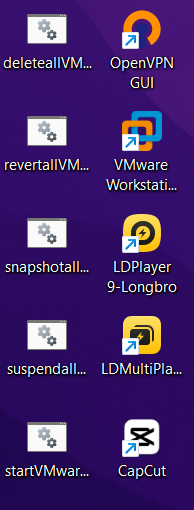
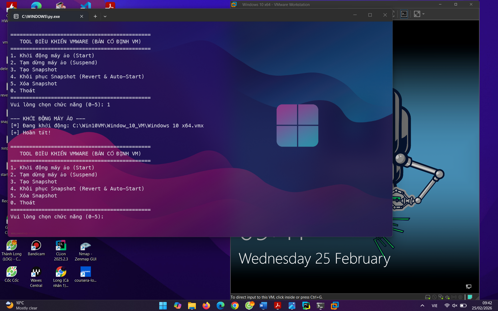
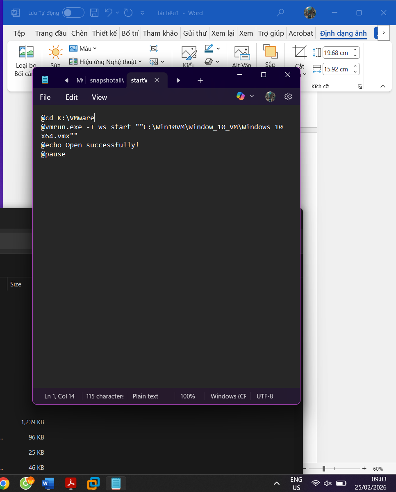
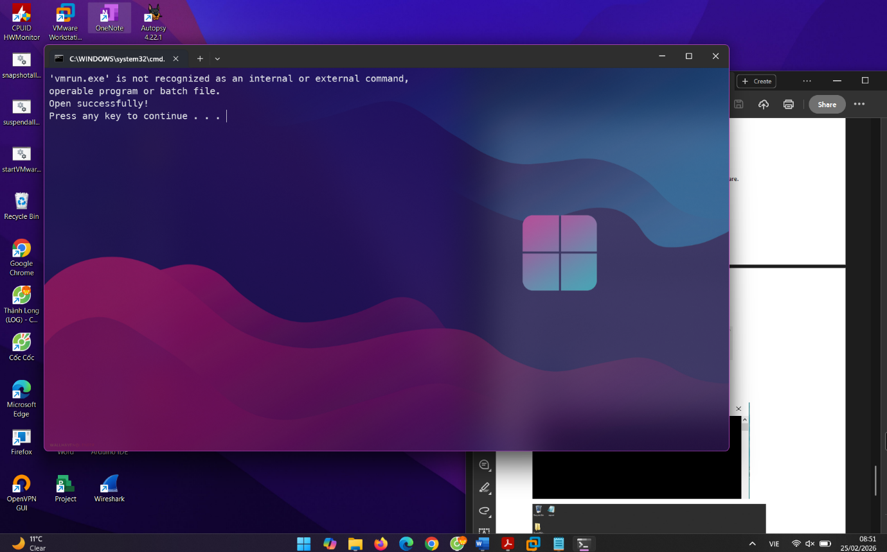
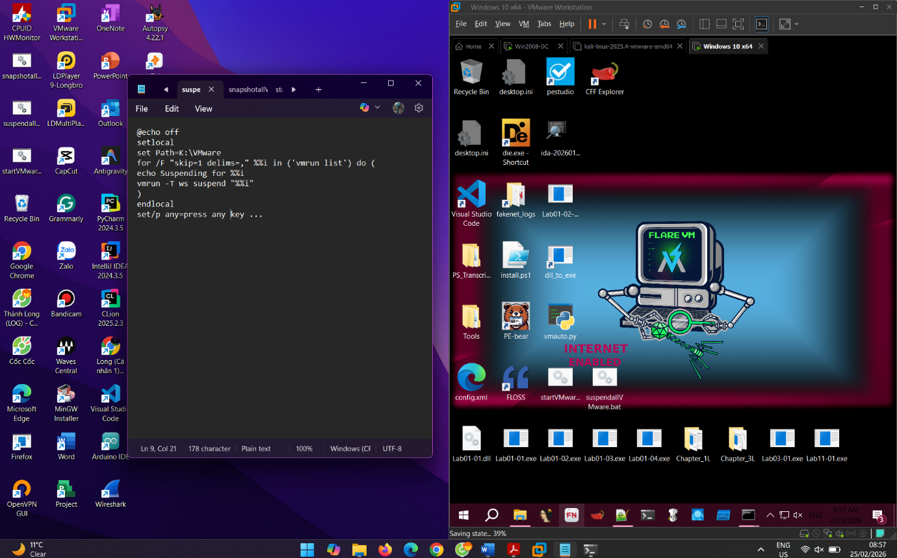
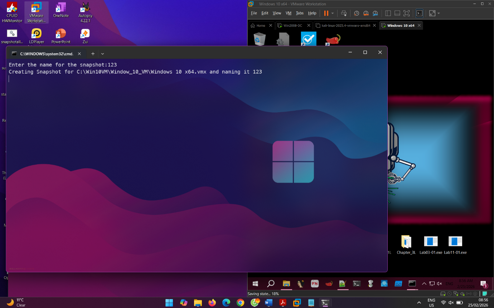
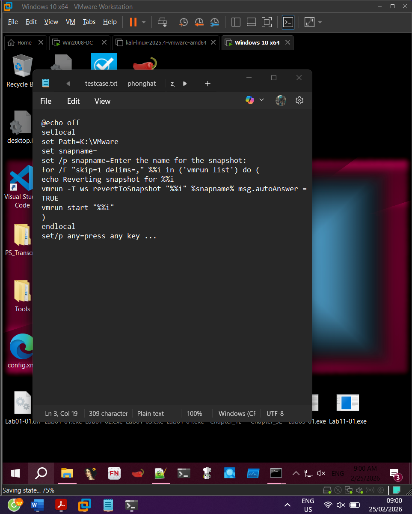
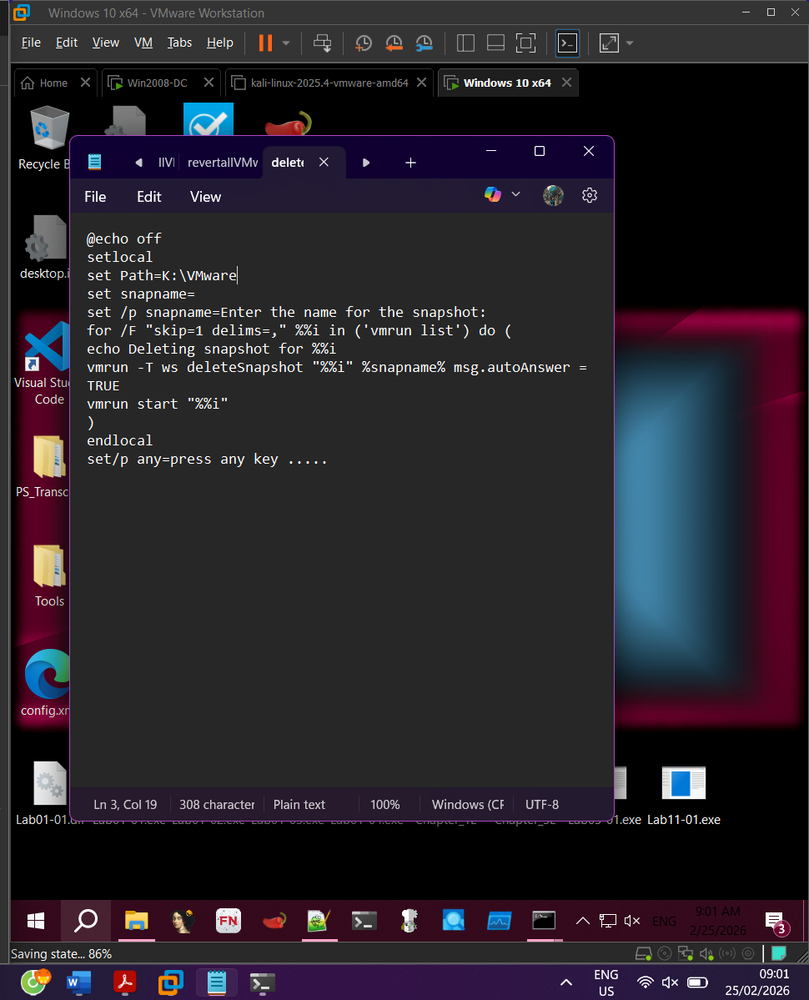

Lab13
Mục tiêu:
- Tự động hóa phân tích mã độc
- Xây dựng công cụ và kịch bản quản lý máy ảo bằng file python
Kết quả thu được:
- Tạo thành công bộ công cụ điều khiển bằng lệnh bash và python
- Thực thi được các chức năng cơ bản tự động như :
- Khởi động máy ảo Tạm dừng Tạo snapshot khôi phục snapshot và xóa snapshot

