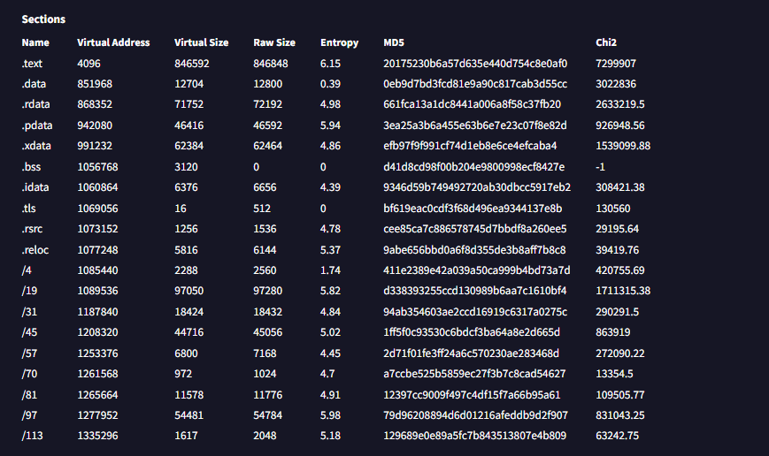
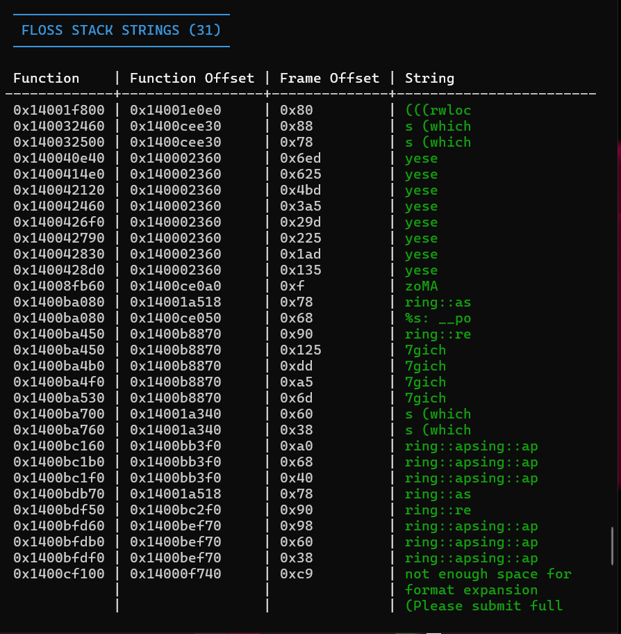
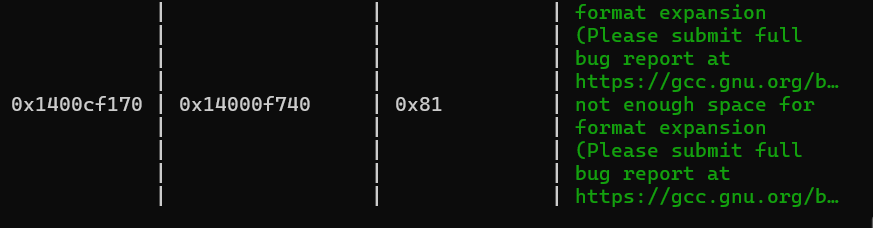
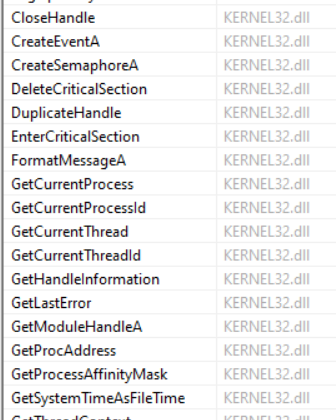
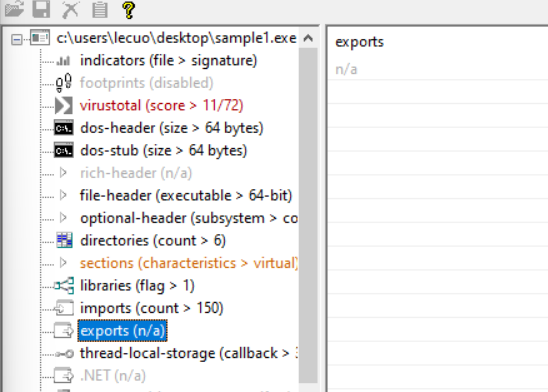
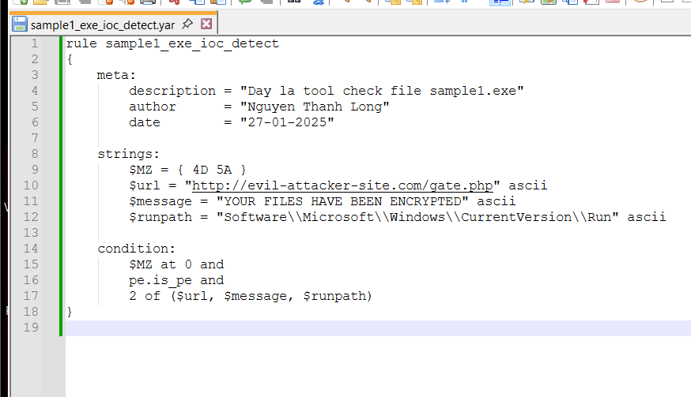
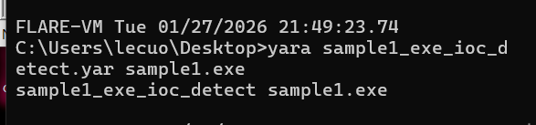
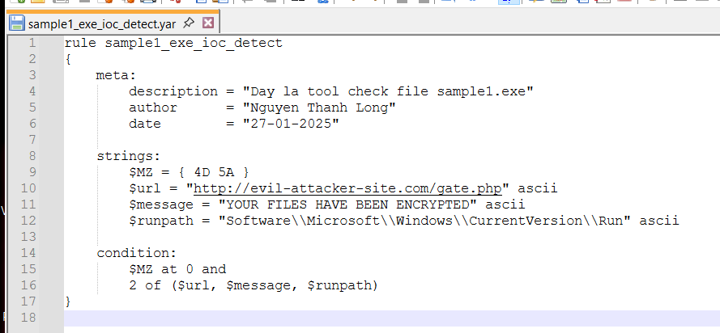

# MALWARE STATIC ANALYSIS REPORT TEMPLATE

# General Information
Report ID: HE195192
Analyst: NGUYEN THANH LONG
Analysis date/time: 26/01/2026
Sample source: (email, **web download****,** USB, EDR alert, sandbox, ...)
Sensitivity level: (**Public** / Internal / Confidential)
Analysis objective: (triage / IOC extraction / family classification / IR support / YARA authoring ...)

# Sample Metadata
## 2.1 File identification
Original filename: **sample1.exe**
Filename as received: **C:\Users\lecuo\Desktop\sample1.exe**
Internal sample storage path: **C:\Users\lecuo\Desktop\sample1.exe**
Size (bytes): **2.82 MiB**
File type (by signature): **PE**
Leading magic bytes: (e.g., 4D 5A) **4D 5A**
Verification tool: (file, CFF Explorer, ...)  **Detect It Easy(DiE)**
Platform/architecture: (PE32 x86 / PE32+ x64 / .NET / script / ...) **PE64**
Note: file extensions are not reliable; identify the file type based on its signature/magic.

## 2.2 Cryptographic hashes (fingerprinting)
MD5: 47123c86e2a32d618d50803c7b6f6570
SHA1: f453adf6cad288903692571c7d8d85273ec4bf66
SHA256: 0b8bcc39b6227fcd9d75532d38122d1f89e03812a2f83bd19b2e01e62a8493a4
ssdeep: (if available)  24576:msxmmZbP1dGzGzk+1K+aaq8QoOesVeL/0PCbv0cfq+Ec0xMki8UsU3Ao9apO+bOk:msxmcbP/GzuXK+hq8QxNgapO+bOcW2
imphash: (if PE) 52c121733fe693994d50679b90dcd188
Section hashes (MD5 per section):
| Section | MD5 |
| --- | --- |
| .text | 20175230b6a57d635e440d754c8e0af0 |
| .rdata | 661fca13a1dc8441a006a8f58c37fb20 |
| .data | 0eb9d7bd3fcd81e9a90c817cab3d55cc |
| .rsrc | cee85ca7c886578745d7bbdf8a260ee5 |
| Other |  |

Hashes support identification and lookups; imphash and per-section hashes are useful for comparing related samples.

## 2.3 Online lookup / multi-AV (if applicable)
Hash lookup results: (labels, detection ratio, notes, ...)
- Platform: VirusTotal
- Detection ratio: 8/72
- Popular threat label: Ransomware
File uploaded: (Yes/No - rationale)
Note: consider the risk of uploading samples. “No detection” does not mean “clean”; for sensitive samples, prefer hash-only lookups.

# Executive Summary (5-10 lines)
Preliminary verdict: (Benign / Suspicious / Malicious)
Suspected type: (dropper, loader, backdoor, ransomware, keylogger, ...)
Key highlights: (packed/obfuscated? notable IOCs? imports suggesting network/persistence?)
Recommended actions: (block IOCs, hunt, dynamic analysis, isolate host, ...)

# Strings & IOCs (Triage Artifacts)
## 4.1 Strings extraction
Tools: (strings, FLOSS, IDA free...)
Notable ASCII strings:
- C2 URL: http://evil-attacker-site.com/gate.php
- C2 endpoint: 192.168.1.100:8080
- Persistence registry key: Software\Microsoft\Windows\CurrentVersion\Run
- Mutex: Global\DarkSide_Ransom_Mutex
- Ransom note message: "YOUR FILES HAVE BEEN ENCRYPTED!"
- User-Agent string: Mozilla/5.0
Notable Unicode (wide) strings: Không phát hiện
Obfuscated/decoded strings (FLOSS):
Decoded strings :1
Stack strings :31
Stack strings: (if reported by FLOSS)

ASCII and Unicode are stored differently; strings may reveal IOCs. FLOSS can help recover decoded and stack strings.

## 4.2 IOC table (keep concise for SOC/IR)
| Category | Indicator(s) / Notes |
| --- | --- |
| Domains | domain: evil-attacker-site.com gcc.gnu.org |
| URLs | url: http://evil-attacker-site.com/gate.php |
| IP addresses | ip:port: 192.168.1.100:8080 |
| Files / Paths | filename/path: |
| Mutex | mutex: Global\DarkSide_Ransom_Mutex |
| Registry keys | key/value: (e.g., Run key)   Software\Microsoft\Windows\CurrentVersion\Run |
| Commands | command: (e.g., netsh firewall ...) |
| Other |  |

If strings are essentially empty or look like garbage, the sample may be packed/obfuscated; use FLOSS and additional triage/unpacking.

# PE Triage (Windows PE only)
## 5.1 PE header quick facts
DOS header: MZ present? YES
PE signature: “PE\0\0” present? YES
Machine: X64
NumberOfSections: 19 (VirusTotal ) 19 (Pestudio)
TimeDateStamp: (plausible or suspicious?) 2026-01-27 02:07:21 UTC
Subsystem: (GUI / Console / Driver)
AddressOfEntryPoint (RVA): 0x00002360
ImageBase: 0x0000000140000000
SizeOfImage / SizeOfHeaders: 1339392 bytes / 1536 bytes
The PE header provides load/entry/import/resource information. TimeDateStamp can be helpful but is sometimes forged.

## 5.2 Data directories (mark present/absent and add notes)
- Import Directory present
- Export Directory absent
- Resource Directory present
- Relocation Directory present
- TLS Directory (code may run before entry point) present
The TLS directory may execute before the entry point and is often used for anti-analysis tricks.

## 5.3 Sections analysis
Populate the table below:
| # | Section | VirtualSize | RawSize | RVA | RawOffset | Flags (R/W/X) | Entropy | Notes |
| --- | --- | --- | --- | --- | --- | --- | --- | --- |
| 0 | .text | 0x000CEB00 | 0x000CEC00 | 0x00001000 | 0x00000600 | R-X | 6.145 | Main executable code |
| 1 | .data | 0x000031A0 | 0x00003200 | 0x000D0000 | 0x000CF200 | RW- | 0.395 | Initialized data |
| 2 | .rdata | 0x00011848 | 0x00011A00 | 0x000D4000 | 0x000D2400 | R-- | 4.975 | Read-only data |
| 3 | .pdata | 0x0000B550 | 0x0000B600 | 0x000E6000 | 0x000E3E00 | R-- | 5.944 | Exception handling metadata |
| 4 | .xdata | 0x0000F3B0 | 0x0000F400 | 0x000F2000 | 0x000EF400 | R-- | 4.855 | Unwind information |
| 5 | .bss | 0x00002C30 | 0x00000000 | 0x00102000 | 0x00000000 | RW- | N/A | Uninitialized data |
| 6 | .idata | 0x000018E8 | 0x00001A00 | 0x00103000 | 0x000EF800 | R-- | 4.391 | Import table |
| 7 | .tls | 0x00000010 | 0x00000200 | 0x00105000 | 0x00100200 | R-- | 0.000 | TLS callbacks present |
| 8 | .rsrc | 0x000004E8 | 0x00000600 | 0x00106000 | 0x00100400 | R-- | 4.785 | Resources / manifest |
| 9 | .reloc | 0x000016B8 | 0x00001800 | 0x00107000 | 0x00100A00 | R-- | 5.370 | Relocation info |
| 10 | /4 | 0x000008F0 | 0x00000A00 | 0x00109000 | 0x00102200 | R-- | 1.743 | MinGW internal section |
| 11 | /19 | 0x00017B1A | 0x00017C00 | 0x0010A000 | 0x00102C00 | R-- | 5.819 | MinGW internal section |
| 12 | /31 | 0x000047F8 | 0x00004800 | 0x00122000 | 0x0011A800 | R-- | 4.836 | MinGW internal section |
| 13 | /45 | 0x0000AEAC | 0x0000B000 | 0x00127000 | 0x0011F000 | R-- | 5.023 | MinGW internal section |
| 14 | /57 | 0x00001A90 | 0x00001C00 | 0x00132000 | 0x0012A000 | R-- | 4.453 | MinGW internal section |
| 15 | /70 | 0x000003CC | 0x00000400 | 0x00134000 | 0x0012BC00 | R-- | 4.698 | MinGW internal section |
| 16 | /81 | 0x00002D3A | 0x00002E00 | 0x00135000 | 0x0012C000 | R-- | 4.909 | MinGW internal section |
| 17 | /97 | 0x0000D4D1 | 0x0000D600 | 0x00138000 | 0x0012EE00 | R-- | 5.976 | MinGW internal section |
| 18 | /113 | 0x00000651 | 0x00000800 | 0x00146000 | 0x0013C400 | R-- | 5.182 | MinGW internal section |

Notes to consider:
- Is .text executable? Any unusual RWX sections?
- Section .text có quyền đọc và thực thi. Không có section nào có cả 3 quyền
- Unusual section names (e.g., UPX0/UPX1) or non-standard names?
- Không phát hiện và các section có số /4, /19… là các section do trình biên dịch MinGW tạo ra
- RawSize = 0 but VirtualSize > 0?
- Chỉ có section .bss
- Unusually high entropy (compression/encryption)?
- Entropy của các section ở mức bình thường, không có section nào có entropy cao bất thường
- Không có dấu hiệu nén hoặc mã hóa
- Common sections: .text / .rdata / .data / .rsrc / .reloc (names can still be misleading).
- => Các section phổ biến như .text, .rdata, .data, .rsrc và .reloc đều tồn tại và có
- đặc điểm phù hợp với cấu trúc PE chuẩn.
## 5.4 Imports analysis (IAT)
Total imported DLLs: 4
Notable DLLs: (wsock32 / wininet / advapi32 / crypt32 / ...) ( ADVAPI32.dll _ KERNEL32.dll_ USER32.dll_ WININET.dll)
Notable APIs: (CreateFile, RegSetValue, connect, ...)
- RegOpenKeyExA,ADVAPI32.dll
- GetAsyncKeyState,USER32.dll
- InternetOpenA,WININET.dll

Inferred capabilities: (**network** / **file** / **registry** / process / service / crypto / anti-debug / ...)

Imports often hint behavior. For example, wsock32/connect/send suggest networking. Some malware resolves APIs dynamically, hiding them from the IAT.

## 5.5 Exports analysis (if DLL)
Export table present: (Yes/**No**)
Notable exports: (name/ordinal) N/A
Suggested invocation: (e.g., rundll32 DLL,Export or rundll32 DLL,#ordinal) N/A
Reviewing exports and how to invoke a DLL (e.g., via rundll32) is useful for testing and dynamic analysis.
=> Mẫu là file thực thi (EXE), không phải DLL và không có export table

## 5.6 Resource analysis
Contents of .rsrc: (icons/dialogs/strings/binary blobs) manifest
Signs of embedded decoy/payload/config: (Yes/No + notes) No
- Không phát hiện payload, file cấu hình hoặc dữ liệu trong resource section
Extraction tools: (Resource Hacker / CFF Explorer / ...)PEStudio
.rsrc commonly contains resources; malware may also embed artifacts, payloads, or decoys there.

# Packed / Obfuscation Assessment
## 6.1 Indicators
- Very few imports, or primarily LoadLibrary + GetProcAddress + RegOpenKeyExA + CreateEventA +  GetAsyncKeyState + …….
- Strings are nearly absent or look like random garbage
- Không. File chứa nhiều strings, bao gồm URL, IP, đường dẫn và thông báo rõ ràng. Strings không bị làm rối hoặc mã hóa (Strings count > 53,000)
- Section names like UPX0/UPX1
- Không phát hiện các section dạng UPX0/UPX1
- Unusually high entropy
- size: 2954642 bytes, entropy: 5.904 không có dấu hiệu nén hoặc mã hóa . Packer thường entropy > 7
- Tool signatures (PEiD / Exeinfo PE / CFF scan) indicate a packer
- PEStudio nhận diện chữ ký Microsoft Linker 2.45 \| MinGW GCC \| PENinja
Packers/cryptors can blind basic static analysis. UPX often shows UPX0/UPX1 and muted strings.

## 6.2 Conclusion & handling approach
Conclusion: (packed? crypted? obfuscated?)
- Mẫu không bị pack, không bị mã hóa và không bị làm rối mã
Next steps: (try UPX -d / dynamic analysis + memory dump / manual unpacking / ...)
- Vì không pack / không obfuscate, KHÔNG cần unpack
# YARA (if applicable)
## 7.1 Rule(s)
Rule name: sample1_exe_ioc_detect
Purpose: (family detection / **IOC detection** / packer detection)
Strings/patterns used:
- "http://evil-attacker-site.com/gate.php"
- "YOUR FILES HAVE BEEN ENCRYPTED"
- "Software\\Microsoft\\Windows\\CurrentVersion\\Run"
Condition logic:
- Check file là PE
- Match ≥ 2 string để giảm false positive
False-positive reduction: (e.g., check MZ at offset 0, use pe module, ...)
Check MZ header
YARA rules combine strings and conditions. You can constrain matches to PE files (e.g., MZ at offset 0) and use the pe module for structural checks.

## 7.2 Testing
Test environment: (sample path, benign set, same-family malware set, ...)
- Yara rule test trên môi trường Windows 10 x64 cài FlareVM
Results: (TP/FP/FN, matched files, notes, ...)

- True Positive (TP): Quy tắc này đã khớp thành công sample1.exe
- False Positive (FP): Không có kết quả dương tính giả nào được quan sát thấy khi quét các tệp không độc
# Final Conclusion & Recommendations (Actionable)
Maliciousness assessment:
- File sample1.exe được xác định là file giả mạo mã độc. Phân tích tĩnh cho thấy nhiều chỉ báo mạnh của ransomware, bao gồm cơ chế giao tiếp C2, persistence qua registri và các chuỗi đặc trưng của ransomware
Expected behavior (static-based hypothesis):
- Thiết lập kết nối mạng đi với máy chủ C2 từ xa
- Mã hóa tệp người dùng và hiển thị thông báo ransomware
- Thực thi dưới dạng tệp thực thi Windows 64-bit
IOCs to block/hunt: (top 5-10 most important indicators)
Network IOCs:
- URL: http://evil-attacker-site.com/gate.php
- IP: 192.168.1.100:8080
Host-based IOCs:
- File hash (SHA256): 0B8BCC39B6227FCD9D75532D38122D1F89E03812A2F83BD19B2E01E62A8493A4
- Registry key: Software\Microsoft\Windows\CurrentVersion\Run
- Process name: sample1.exe
Recommended next actions:
**( ) Dynamic analysis**
**( ) Unpacking**
**( ) Hunt by imphash / ssdeep / per-section hash**
**( ) Deploy YARA into the pipeline**
**( ) IR actions (isolate, host triage, log search, ...)**

# Appendix (optional)
## A) Command log (reproducibility)
file sample output: C:\Users\lecuo\Desktop\sample1.exe
md5deep/sha256sum output: SHA256
0B8BCC39B6227FCD9D75532D38122D1F89E03812A2F83BD19B2E01E62A8493A4
strings -a output path: C:\Users\lecuo\Desktop\strings_ascii.txt
strings -el output path: C:\Users\lecuo\Desktop\strings_unicode.txt
floss output path: C:\Users\lecuo\Desktop\floss_result.txt
Tool screenshots / notes:
Windows 11 thật

## B) Artifact dump
- Full imports list
- Key libraries:
- KERNEL32.dll
- ADVAPI32.dll
- USER32.dll
- WININET.dll
- Full sections dump : .text, .data, .rdata, .rsrc, .reloc và 1 vài section do MinGW tạo ra như /4, /19, /45, /57, /70, /81, /97, /113
- Extracted resources hashes
- Manifest resource present
- Không phát hiện tài nguyên bị mã hóa
- YARA rule(s)
- C:\Users\lecuo\Desktop\sample1_exe_ioc_detect.yar

# Summary
Sample: sample1.exe
Verdict: Malicious (fake ransomware)
Key IOCs: (domain / IP / registry Run key / paths)
- URL: http://evil-attacker-site.com/gate.php
- IP: 192.168.1.100:8080
- Registry Run key: Software\Microsoft\Windows\CurrentVersion\Run
- File name/path: C:\Users\lecuo\Desktop\sample1.exe
Capabilities (inferred): (network / persistence / ...)
Confidence: (Low / Med / **High**) + rationale (packed? clear strings? clear imports?)
Độ tin cậy cao do file không bị pack, có nhiều string rõ ràng, import minh bạch và các IOC đặc trưng
Next steps:
- Thực hiện phân tích động trong máy ảo để xác nhận hành vi
- Triển khai quy tắc YARA để phát hiện
- Chặn IOC được xác định ở network và endpoint level
- Tiến hành các hành động ứng phó sự cố nếu xác nhận nhiễm mã độc
