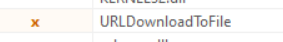
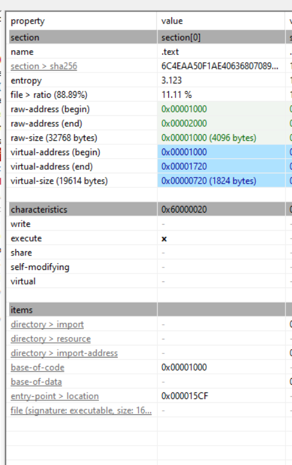
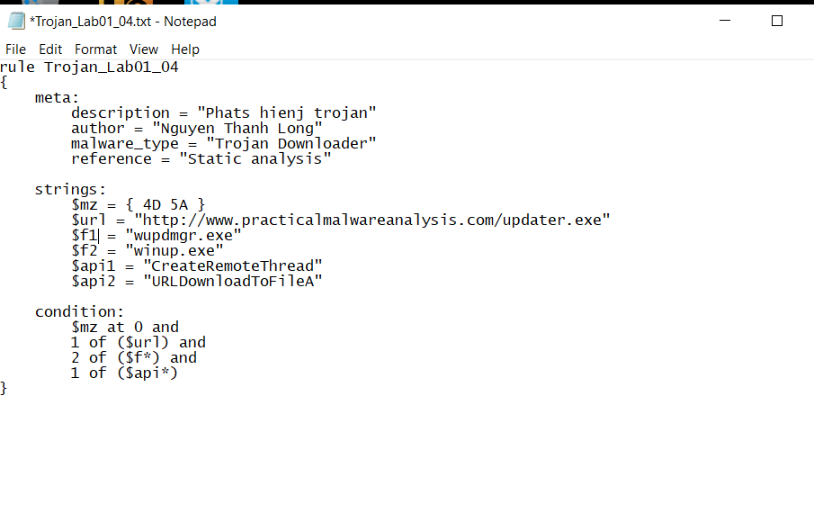
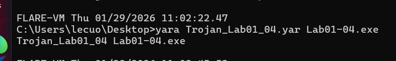
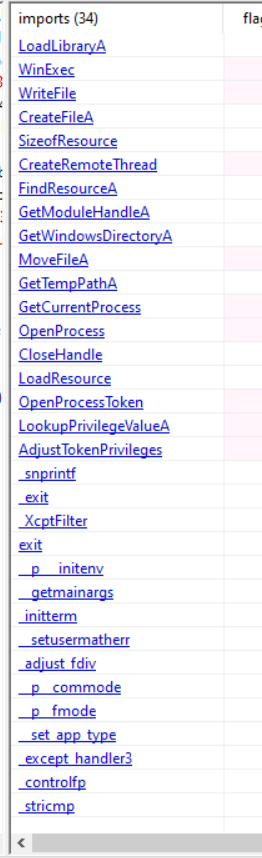
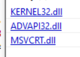

# MALWARE STATIC ANALYSIS REPORT TEMPLATE
# General Information
Report ID: HE195192
Analyst: NGUYEN THANH LONG
Analysis date/time: 29-01-2026
Sample source: (email, **web download**, USB, EDR alert, sandbox, ...)
Sensitivity level: (**Public** / Internal / Confidential)
Analysis objective: (triage / **IOC extraction** / family classification / IR support / YARA authoring ...)
# Sample Metadata
## 2.1 File identification
Original filename: Lab01-04.exe
Filename as received:
Internal sample storage path:	 C:\Users\lecuo\Desktop\Lab01-04.exe
Size (bytes): 36.00 KiB
File type (by signature):  PE32
Leading magic bytes: (e.g., 4D 5A) 4D 5A
Verification tool: (file, CFF Explorer, ...)  Detect It Easy(DiE)
Platform/architecture: (PE32 x86 / PE32+ x64 / .NET / script / ...) PE32 (x86), native C++  Windows(95)
Note: file extensions are not reliable; identify the file type based on its signature/magic.

## 2.2 Cryptographic hashes (fingerprinting)
MD5: 625ac05fd47adc3c63700c3b30de79ab
SHA1: 9369d80106dd245938996e245340a3c6f17587fe
SHA256: 0fa1498340fca6c562cfa389ad3e93395f44c72fd128d7ba08579a69aaf3b126
ssdeep: (if available): 96:TF0MgAr71nxY9AAIvqZ2ZNHHsP4oynLKcm5OzG38U6p2WL4P4oyn:iJaPLjC2ZNHMP4oynLKL38jp2VP4oyn
imphash: (if PE) : aade0ea6fbdcd9b8e96fe999cae6f603
Section hashes (MD5 per section):
| Section | MD5 |
| --- | --- |
| .text | 77df9f7ebc4a2bc4bdf2b454d7635aee |
| .rdata | d630e1eb49ed821e38202aefef911a39 |
| .data | d9a3822a7733a76776d8b6e64e364b9d |
| .rsrc | 398569177d4d82090d3e1747be560f9a |
| Other |  |

Hashes support identification and lookups; imphash and per-section hashes are useful for comparing related samples.
## 2.3 Online lookup / multi-AV (if applicable)
Hash lookup results: (labels, detection ratio, notes, ...)
- Platform: VirusTotal
- Detection ratio: 63/70
- Popular threat label: Trojan
File uploaded: (**Yes**/No - rationale)
Note: consider the risk of uploading samples. “No detection” does not mean “clean”; for sensitive samples, prefer hash-only lookups.
# Executive Summary (5-10 lines)
Preliminary verdict: (Benign / Suspicious / **Malicious**)
Suspected type: (dropper, loader, backdoor, ransomware, keylogger, ...) Trojan
Key highlights: (packed/obfuscated? **notable IOCs? imports suggesting network/persistence**?)
- Không mã hóa và không đóng gói và được biên dịch bằng VS code 6.0
- Các chuỗi ASCII lộ ra 1 URL để tải xuống 1 gói nào đó

Recommended actions: (block IOCs, hunt, **dynamic analysis**, **isolate host**, ...)
# Strings & IOCs (Triage Artifacts)
## 4.1 Strings extraction
Tools: (**strings, FLOSS**, ...)
Notable ASCII strings:
- !This program cannot be run in DOS mode.
- http://www.practicalmalwareanalysis.com/updater.exe
- \system32\wupdmgr.exe
- \system32\wupdmgrd.exe
- \winup.exe
- winlogon.exe
- SeDebugPrivilege
- URLDownloadToFileA
- urlmon.dll
- tải payload từ xa, giả dạng Windows update và có khả năng leo quyền
Notable Unicode (wide) strings: N/A
Obfuscated/decoded strings (FLOSS): N/A
Stack strings: (if reported by FLOSS) : N/A
ASCII and Unicode are stored differently; strings may reveal IOCs. FLOSS can help recover decoded and stack strings.
## 4.2 IOC table (keep concise for SOC/IR)
| Category | Indicator(s) / Notes |
| --- | --- |
| Domains | domain:	practicalmalwareanalysis.com |
| URLs | url: http://www.practicalmalwareanalysis.com/updater.exe |
| IP addresses | ip:port: N/A |
| Files / Paths | filename/path: \system32\wupdmgr.exe 
\system32\wupdmgrd.exe 
\winup.exe |
| Mutex | mutex: N/A |
| Registry keys | key/value: (e.g., Run key) N/A |
| Commands | command: (e.g., netsh firewall ...) N/A |
| Other | Target process: winlogon.exe (Mẫu chèn mã vào winlogon.exe để thực thi lén lút theo quy trình hệ thống đáng tin cậy) Privilege: SeDebugPrivilege |

If strings are essentially empty or look like garbage, the sample may be packed/obfuscated; use FLOSS and additional triage/unpacking.
# PE Triage (Windows PE only)
## 5.1 PE header quick facts
DOS header: MZ present? YES
PE signature: “PE\0\0” present? YES
Machine: x86 (32-bit)
NumberOfSections: 4
TimeDateStamp: (plausible or **suspicious**?)
Subsystem: (**GUI** / Console / Driver)
AddressOfEntryPoint (RVA): 0x000015CF

ImageBase: 0x00400000
SizeOfImage / SizeOfHeaders: file > info,  0x00009000 / 0x00001000
The PE header provides load/entry/import/resource information. TimeDateStamp can be helpful but is sometimes forged.
## 5.2 Data directories (mark present/absent and add notes)
- Import Directory :  present  3 KERNEL32.dll ADVAPI32.dll  MSVCRT.dll
- Export Directory absent
- Resource Directory present
- Relocation Directory absent
- TLS Directory (code may run before entry point) absent
The TLS directory may execute before the entry point and is often used for anti-analysis tricks.
## 5.3 Sections analysis
Populate the table below:
| Section | VirtualSize | RawSize | RVA | RawOffset | Flags (R/W/X) | Entropy | Notes |
| --- | --- | --- | --- | --- | --- | --- | --- |
| .text | 0x00000720 (1824 B) | 0x00001000 (4096 B) | 0x00001000 | 0x00001000 | R / X | 3.123 | Executable code section, normal entropy |
| .rdata | 0x000003D2 (978 B) | 0x00001000 (4096 B) | 0x00002000 | 0x00002000 | R | 1.591 | Read-only data, imports & strings |
| .data | 0x0000014C (332 B) | 0x00001000 (4096 B) | 0x00003000 | 0x00003000 | R / W | 0.508 | Global/static variables |
| .rsrc | 0x00004060 (16480 B) | 0x00005000 (20480 B) | 0x00004000 | 0x00004000 | R | 0.713 | Resources section, large but normal |

Notes to consider:
- Is .text executable? Any unusual RWX sections?
- Yes, .text có quyền thực thi và không có RWX
- Unusual section names (e.g., UPX0/UPX1) or non-standard names?
- Không có
- RawSize = 0 but VirtualSize > 0?
- Không có
- Unusually high entropy (compression/encryption)?
- Không có
- Common sections: .text / .rdata / .data / .rsrc / .reloc (names can still be misleading).
- Không có
## 5.4 Imports analysis (IAT)
Total imported DLLs: 3
Notable DLLs: (wsock32 / wininet / advapi32 / crypt32 / ...)
- (KERNEL32.dll ADVAPI32.dll  MSVCRT.dll)
Notable APIs: (CreateFile, RegSetValue, connect, ...)
Inferred capabilities: (network / file / registry / process / service / crypto / anti-debug / ...)
Imports often hint behavior. For example, wsock32/connect/send suggest networking. Some malware resolves APIs dynamically, hiding them from the IAT.
## 5.5 Exports analysis (if DLL) N/A
**Export table present: (Yes/No)**** No**
**Notable exports: (name/ordinal)**** N/A**
**Suggested invocation: (e.g., rundll32 DLL,Export or rundll32 DLL,#ordinal)**** N/A**
**Reviewing exports and how to invoke a DLL (e.g., via rundll32) is useful for testing and dynamic analysis.**
## 5.6 Resource analysis
Contents of .rsrc: (icons/dialogs/strings/binary blobs)
- No icons, dialogs, version information
Signs of embedded decoy/payload/config: (Yes/No + notes)  No
- Phần .rsrc thể hiện entropy thấp (0,85)
- Tài nguyên bắt đầu bằng tiêu đề MZ cấu trúc giống PE
- Không có hard-coded configuration data, encrypted blobs hoặc decoy artifacts nào được xác định trong phần tài nguyên.
- Không phát hiện payload, file cấu hình hoặc dữ liệu trong resource section

Extraction tools: (Resource Hacker / CFF Explorer / ...) PEStudio
.rsrc commonly contains resources; malware may also embed artifacts, payloads, or decoys there.

# Packed / Obfuscation Assessment
## 6.1 Indicators
- Very few imports, or primarily LoadLibrary + GetProcAddress + WinExec + CreateRemoteThread + OpenProcess + AdjustTokenPrivileges
- Strings are nearly absent or look like random garbage
- chuỗi ASCII rõ ràng, bao gồm URL, domain, đường dẫn hệ thống, tên process và các thông báo có ý nghĩa
- Các chuỗi không bị rối, không bị mã hóa và không có dấu hiệu random garbage
- Section names like UPX0/UPX1
- Không phát hiện các section dạng UPX0/UPX1

- Unusually high entropy
- Không có cái nào cao bất thường và tổng là size: 36864 bytes, entropy: 1.177
- Tool signatures (PEiD / Exeinfo PE / CFF scan) indicate a packer
Packers/cryptors can blind basic static analysis. UPX often shows UPX0/UPX1 and muted strings.
## 6.2 Conclusion & handling approach
Conclusion: (packed? crypted? obfuscated?)
- Mẫu không bị pack, không bị mã hóa và không bị làm rối mã
Next steps: (try UPX -d / dynamic analysis + memory dump / manual unpacking / ...)
- Vì không pack / không obfuscate, KHÔNG cần unpack
# YARA (if applicable)
## 7.1 Rule(s)
Rule name: Trojan_Lab01_04
Purpose: (**family detection / IOC detection** / packer detection)
Strings/patterns used:

Condition logic: match dấu hiệu file MZ và URL và 1 trong 2 biến có chứa 2 file winup và wupdmgr và iport thêm 1 trong 2 api
False-positive reduction: (e.g., check MZ at offset 0, use pe module, ...)
- **Kiểm tra tiêu đề MZ ở offset 0**
- **Hạn chế quy tắc đối với tệp PE**
YARA rules combine strings and conditions. You can constrain matches to PE files (e.g., MZ at offset 0) and use the pe module for structural checks.

## 7.2 Testing
Test environment: (sample path, benign set, same-family malware set, ...)
- Yara rule test trên môi trường Windows 10 x64 cài FlareVM
Results: (TP/FP/FN, matched files, notes, ...)

# Final Conclusion & Recommendations (Actionable)
Maliciousness assessment:
- Mẫu Lab01-04.exe được đánh giá là Malicious.
- Mặc dù file không bị pack, không mã hóa strings và có cấu trúc PE hợp lệ, nhưng phân tích tĩnh cho thấy nhiều hành vi độc hại rõ ràng như tải payload từ xa, nâng quyền, và inject code vào tiến trình hệ thống (winlogon.exe). Điều này cho thấy malware nguy hiểm ở mức logic/hành vi
Expected behavior (static-based hypothesis):
- Tải file từ xa qua đường dẫn
Ghi file xuống hệ thống với tên giả mạo Windows Update (wupdmgr.exe, winup.exe)
Thực thi payload bằng WinExec
Nâng quyền thông qua SeDebugPrivilege
Inject code vào tiến trình hợp pháp winlogon.exe để ẩn mình và duy trì thực thi
IOCs to block/hunt: (top 5-10 most important indicators)
Network / URL
http://www.practicalmalwareanalysis.com/updater.exe
Domain: practicalmalwareanalysis.com
Files / Paths
\system32\wupdmgr.exe
\system32\wupdmgrd.exe
\winup.exe
Process / Behavior
Target process: winlogon.exe
Privilege: SeDebugPrivilege
Recommended next actions:
**( ) Dynamic analysis**
**( ) Unpacking**
**( ) Hunt by imphash / ssdeep / per-section hash**
**( ) Deploy YARA into the pipeline**
**( ) IR actions (isolate, host triage, log search, ...)**
# Appendix (optional)
## A) Command log (reproducibility)
file sample output: N/A
md5deep/sha256sum output: N/A
strings -a output path: N/A
strings -el output path: N/A
floss output path: N/A
Tool screenshots / notes: win 11 thật

## B) Artifact dump
- Full imports list : 34

- Full sections dump : .text, .data, .rdata, .rsrc,
- Key libraries:

- Extracted resources hashes : N/A
- YARA rule(s) : C:\Users\lecuo\Desktop\Trojan_Lab01_04.yar
# Summary
Sample: Lab01-04.exe
Verdict: Malicious (Trojan – Downloader/Loader)
Key IOCs: (domain / IP / registry Run key / paths)
Domain / URL: http://www.practicalmalwareanalysis.com/updater.exe
File paths / names:
- \system32\wupdmgr.exe
- \system32\wupdmgrd.exe
- \winup.exe
Target process: winlogon.exe
Privilege: SeDebugPrivilege
Capabilities (inferred): (network / persistence / ...)
Network: Tải payload từ xa thông qua URL (resolve API động)
Execution: Thực thi file tải về bằng WinExec
Privilege escalation: Yêu cầu quyền SeDebugPrivilege
Process injection: Inject code vào tiến trình hệ thống winlogon.exe
Masquerading: Giả mạo file/thành phần Windows Update
Confidence: (Low / Med / **High**) + rationale (packed? clear strings? clear imports?)
Next steps:
- Thực hiện dynamic analysis để xác nhận hành vi runtime (download & injection)
- Triển khai YARA rule vào pipeline SOC/IR để phát hiện các mẫu tương tự
- Nếu phát hiện đã thực thi: cô lập host, kiểm tra tiến trình winlogon.exe, rà soát log network và file system
