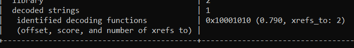
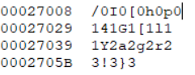
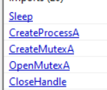
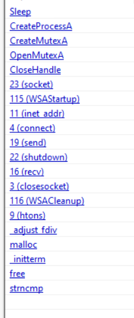
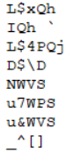
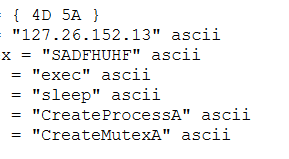
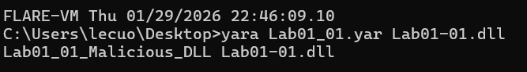
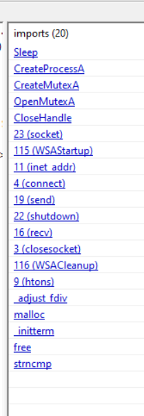
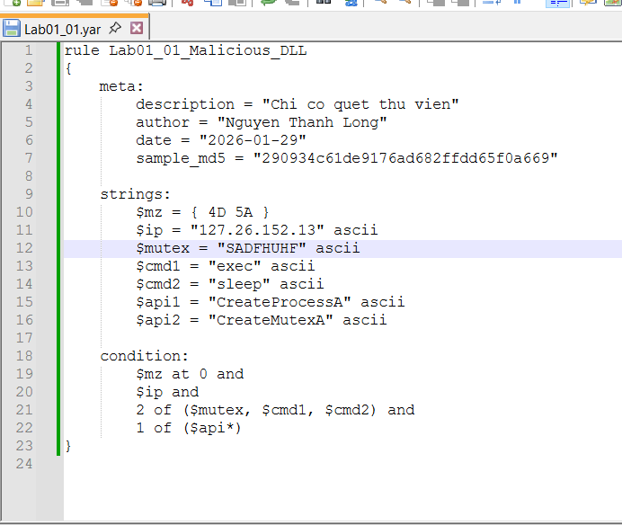

# MALWARE STATIC ANALYSIS REPORT TEMPLATE

# General Information
Report ID: HE195192
Analyst: NGUYEN THANH LONG
Analysis date/time: 29/-1/2026
Sample source: (email**, web download**, USB, EDR alert, sandbox, ...)
Sensitivity level: (**Public** / Internal / Confidential)
Analysis objective: (triage / **IOC extraction / family classification** / IR support / YARA authoring ...)

# Sample Metadata
## 2.1 File identification
Original filename: Lab01-01.dll
Filename as received: c:\users\lecuo\desktop\lab01-01.dll
Internal sample storage path: c:\users\lecuo\desktop\lab01-01.dll
Size (bytes): 163840 BYTES
File type (by signature): dynamic-link-library, 32-bit, GUI
Leading magic bytes: (e.g., 4D 5A) 4D 5A
Verification tool: (file, CFF Explorer, ...) HxD PEStudio  DetectItEasy
Platform/architecture: (PE32 x86 / PE32+ x64 / .NET / script / ...)
PE32 executable (DLL) (GUI) Intel 80386, for MS Windows
Note: file extensions are not reliable; identify the file type based on its signature/magic.

## 2.2 Cryptographic hashes (fingerprinting)
MD5: 290934c61de9176ad682ffdd65f0a669
SHA1: a4b35de71ca20fe776dc72d12fb2886736f43c22
SHA256: f50e42c8dfaab649bde0398867e930b86c2a599e8db83b8260393082268f2dba
ssdeep: (if available) 48:aVD3M6gl4PXzLceRoCpbDIa1XBtz2Wuw009WuwazHSz:MrMAzLctgt5z2Wz0sWzSHS
imphash: (if PE) 	850a8b8b585d7874d0431e8e45d74606
Section hashes (MD5 per section):
| Section | MD5 |
| --- | --- |
| .text | 65d3ddf9778db8d01e57b5825fbd93ad |
| .rdata | 530532a38a38ea1219e691b8f16d10e9 |
| .data | 0211086333be22ae2620b568fde46fe3 |
| .rsrc | a082f3572d17cd40272b3bcfd96b7b2d |
| Other |  |

Hashes support identification and lookups; imphash and per-section hashes are useful for comparing related samples.

## 2.3 Online lookup / multi-AV (if applicable)
Hash lookup results: (labels, detection ratio, notes, ...)
Platform: VirusTotal
Detection ratio: 40/72
Popular threat label: Trojan

File uploaded: (**Yes**/No - rationale)
Note: consider the risk of uploading samples. “No detection” does not mean “clean”; for sensitive samples, prefer hash-only lookups.

# Executive Summary (5-10 lines)
Preliminary verdict: (Benign / Suspicious / **Malicious**)
Suspected type: (dropper, loader, backdoor, ransomware, keylogger, ...)Trojan
Key highlights: (packed/**obfuscated? notable IOCs? imports suggesting network/persistence**?)
- Phát hiện hàm giải mã tiềm năng tại offset 0x10001010

- CreateProcessA → tạo tiến trình khác (dropper / loader)
- CreateMutexA + OpenMutexA → chống chạy nhiều lần (anti-duplicate)
- Sleep → né sandbox / trì hoãn hành vi
- Import WS2_32.dll → dùng socket / network
- IP hardcoded (127.26.152.13), không phải localhost chuẩn (127.0.0.1) → C2
- Có các chuỗi hình như bị obfucate

Recommended actions: (block IOCs, hunt, **dynamic analysis, isolate host,** ...)

# Strings & IOCs (Triage Artifacts)
## 4.1 Strings extraction
Tools: (**strings, FLOSS**, ...)
Notable ASCII strings:
- !This program cannot be run in DOS mode.
- KERNEL32.dll
- WS2_32.dll
- MSVCRT.dll
- CreateProcessA
- CreateMutexA
- OpenMutexA
- Sleep
- CloseHandle
- exec
- sleep
- hello
- 127.26.152.13
- SADFHUHF
Notable Unicode (wide) strings: N/A
Obfuscated/decoded strings (FLOSS): Một hàm giải mã đã được xác định ở 0x10001010
Stack strings: (if reported by FLOSS) : N/A
ASCII and Unicode are stored differently; strings may reveal IOCs. FLOSS can help recover decoded and stack strings.

## 4.2 IOC table (keep concise for SOC/IR)
| Category | Indicator(s) / Notes |
| --- | --- |
| Domains | domain: n/a |
| URLs | url: n/a |
| IP addresses | ip:port: 127.26.152.13 |
| Files / Paths | filename/path: Lab01-01.dll |
| Mutex | mutex: có thể là SADFHUHF |
| Registry keys | key/value: (e.g., Run key) n/a |
| Commands | command: (e.g., netsh firewall ...) exec, sleep |
| Other | CreateProcessA, CreateMutexA, WS2_32.dll cho biết khả năng thực thi, kiểm soát và kết nối mạng |

If strings are essentially empty or look like garbage, the sample may be packed/obfuscated; use FLOSS and additional triage/unpacking.

# PE Triage (Windows PE only)
## 5.1 PE header quick facts
DOS header: MZ present? YES
PE signature: “PE\0\0” present? YES
Machine:
NumberOfSections: 4
TimeDateStamp: (plausible or **suspicious**?)
Subsystem: (GUI / **Console** / Driver)
AddressOfEntryPoint (RVA): 0x000012FA (section: .text)
ImageBase: 0x10000000
SizeOfImage / SizeOfHeaders:  0x00028000/ 0x00001000
The PE header provides load/entry/import/resource information. TimeDateStamp can be helpful but is sometimes forged.

## 5.2 Data directories (mark present/absent and add notes)
- Import Directory 3 present
- Export Directory 0  absent
- Resource Directory 0 absent
- Relocation Directory present
- TLS Directory (code may run before entry point) absent
The TLS directory may execute before the entry point and is often used for anti-analysis tricks.

## 5.3 Sections analysis
Populate the table below:
| Section | VirtualSize | RawSize | RVA | RawOffset | Flags (R/W/X) | Entropy | Notes |
| --- | --- | --- | --- | --- | --- | --- | --- |
| .text | 0x0000039E (926 bytes) | 0x00001000 (4096 bytes) | 0x00001000 | 0x00001000 | R-X | 1.900 | Executable code section, contains entry point (0x12FA) |
| .rdata | 0x00023FC6 (147,398 bytes) | 0x00024000 (147,456 bytes) | 0x00002000 | 0x00002000 | R-- | 0.026 | Large read-only data section, likely stores strings and import data |
| .data | 0x0000006C (108 bytes) | 0x00001000 (4096 bytes) | 0x00026000 | 0x00026000 | RW- | 0.106 | Global variables / runtime data |
| .reloc | 0x00000204 (516 bytes) | 0x00001000 (4096 bytes) | 0x00027000 | 0x00027000 | R-- | 0.260 | Relocation information for DLL |

Notes to consider:
- Is .text executable? Any unusual RWX sections?
- Section .text có quyền thực thi và không có section nào có cả 3 quyền
- Unusual section names (e.g., UPX0/UPX1) or non-standard names?
- Không có
- RawSize = 0 but VirtualSize > 0?
- Không có
- Unusually high entropy (compression/encryption)?
- Không có
- Common sections: .text / .rdata / .data / .rsrc / .reloc (names can still be misleading).
- - Không có chỉ có 4 cái : .text / .rdata / .data /  .reloc
## 5.4 Imports analysis (IAT)
Total imported DLLs:	 3
Notable DLLs: (wsock32 / wininet / advapi32 / crypt32 / ...)
Notable APIs: (CreateFile, RegSetValue, connect, ...)

Inferred capabilities: (network / file / registry / process / service / crypto / anti-debug / ...)
Imports often hint behavior. For example, wsock32/connect/send suggest networking. Some malware resolves APIs dynamically, hiding them from the IAT.

## 5.5 Exports analysis (if DLL) N/A
Export table present: (Yes/No) No
Notable exports: (name/ordinal)
Suggested invocation: (e.g., rundll32 DLL,Export or rundll32 DLL,#ordinal)
Reviewing exports and how to invoke a DLL (e.g., via rundll32) is useful for testing and dynamic analysis.

## 5.6 Resource analysis N/A
Contents of .rsrc: (icons/dialogs/strings/binary blobs)
Signs of embedded decoy/payload/config: (Yes/No + notes)
Extraction tools: (Resource Hacker / CFF Explorer / ...)
.rsrc commonly contains resources; malware may also embed artifacts, payloads, or decoys there.

# Packed / Obfuscation Assessment
## 6.1 Indicators
- Very few imports, or primarily LoadLibrary + GetProcAddress

- Strings are nearly absent or look like random garbage

- Section names like UPX0/UPX1
- Không có
- Unusually high entropy
- Không có
- Tool signatures (PEiD / Exeinfo PE / CFF scan) indicate a packer PEStudio
Packers/cryptors can blind basic static analysis. UPX often shows UPX0/UPX1 and muted strings.

## 6.2 Conclusion & handling approach
Conclusion: (packed? crypted? obfuscated?)
- Không packed không crypted mà có một vài mẫu bị xáo trộn chuỗi
Next steps: (try UPX -d / **dynamic analysis + memory dump** / manual unpacking / ...)

# YARA (if applicable)
## 7.1 Rule(s)
Rule name: Lab01_01
Purpose: (family detection / **IOC detection** / packer detection)
Strings/patterns used:

Condition logic: tệp thu viện chứa MZ header và đại chỉ ip phải khớp  và 2 trong số biến mutex hoặc các tiến trình thực ti có tên file exe và sleep và phải khớp 1 trong 2 api được import vào
False-positive reduction: (e.g., check MZ at offset 0, use pe module, ...)
YARA rules combine strings and conditions. You can constrain matches to PE files (e.g., MZ at offset 0) and use the pe module for structural checks.

## 7.2 Testing
Test environment: (sample path, benign set, same-family malware set, ...)
Yara rule test trên môi trường Windows 10 x64 cài FlareVM
Results: (TP/FP/FN, matched files, notes, ...)

# Final Conclusion & Recommendations (Actionable)
Maliciousness assessment: Trojan malicious DLL
Expected behavior (static-based hypothesis):
- Tạo mutex để đảm bảo thực thi một phiên bản
- Tạo các quy trình bổ sung bằng cách sử dụng lệnh gọi API Windows
- Thiết lập mạng bằng Winsock, có khả năng kết nối IP được mã hóa cứng
- Thực thi logic lệnh cơ bản và trì hoãn thực thi, có khả năng tránh phát hiện

IOCs to block/hunt: (top 5-10 most important indicators)
- IP address: 127.26.152.13
- Malicious DLL filename: Lab01-01.dll
- Suspicious mutex string: SADFHUHF
- Suspicious command strings: exec, sleep
- YARA rule: Lab01_01
- Imported library: WS2_32.dll
Recommended next actions:
**( )**** Dynamic analysis**
**( )**** Unpacking**
**( )**** Hunt by ****imphash**** / ****ssdeep**** / per-section hash**
**( )**** Deploy YARA into the pipeline**
**( )**** IR actions (isolate, host triage, log search, ...)**

# Appendix (optional)
## A) Command log (reproducibility)
file sample output: N/A
md5deep/sha256sum output: N/A
strings -a output path: N/A
strings -el output path: N/A
floss output path: N/A
Tool screenshots / notes: Win 11 thật

## B) Artifact dump
- Full imports list

- Full sections dump : .text, .rdata, .data, .reloc
- Extracted resources hashes N/A
- YARA rule(s)

# Summary
Sample: Lab01-01.dll
Verdict: Malicious – Trojan-style malicious DLL.
Key IOCs: (domain / IP / registry Run key / paths)
- IP address: 127.26.152.13
- File name: Lab01-01.dll
- Mutex (suspected): SADFHUHF
- Suspicious strings: exec, sleep

- YARA rule: Lab01_01
Capabilities (inferred): (network / persistence / ...)
Tạo quy trình và kiểm soát thực thi
Thực  thi một phiên bản dựa trên Mutex
Giao tiếp mạng qua Winsock
Độ trễ thực thi và thực thi lệnh cơ bản
Confidence: (Low / Med / **High**) + rationale (packed? clear strings? clear imports?)
Next steps: Thực hiện phân tích động trong môi trường VM, giám sát hoạt động mạng và triển khai quy tắc YARA để chủ động phát hiện và săn tìm mối đe dọa
