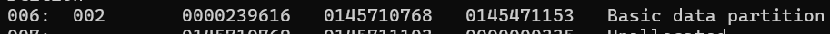
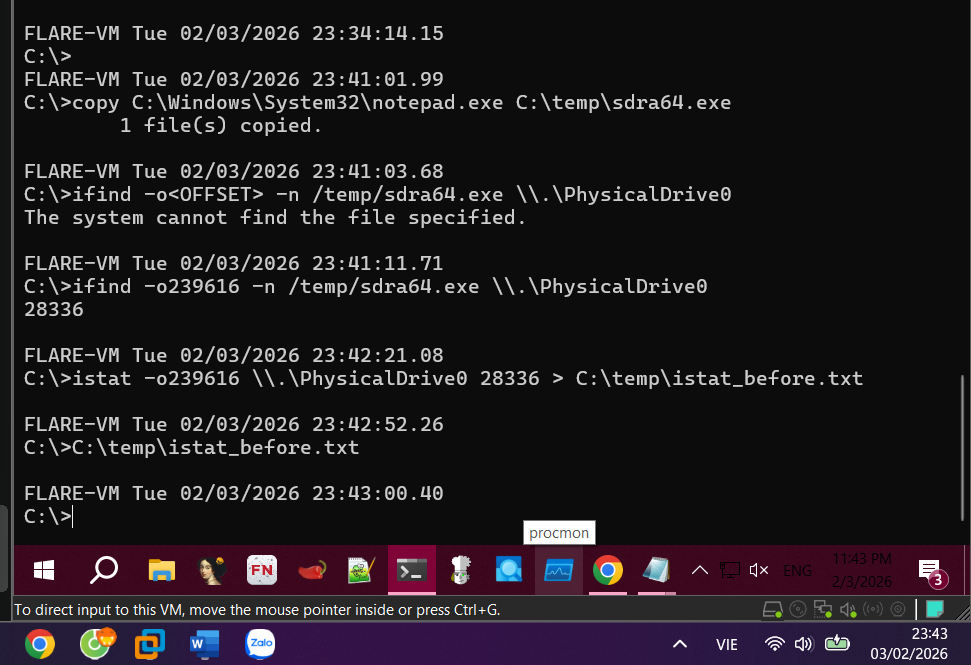
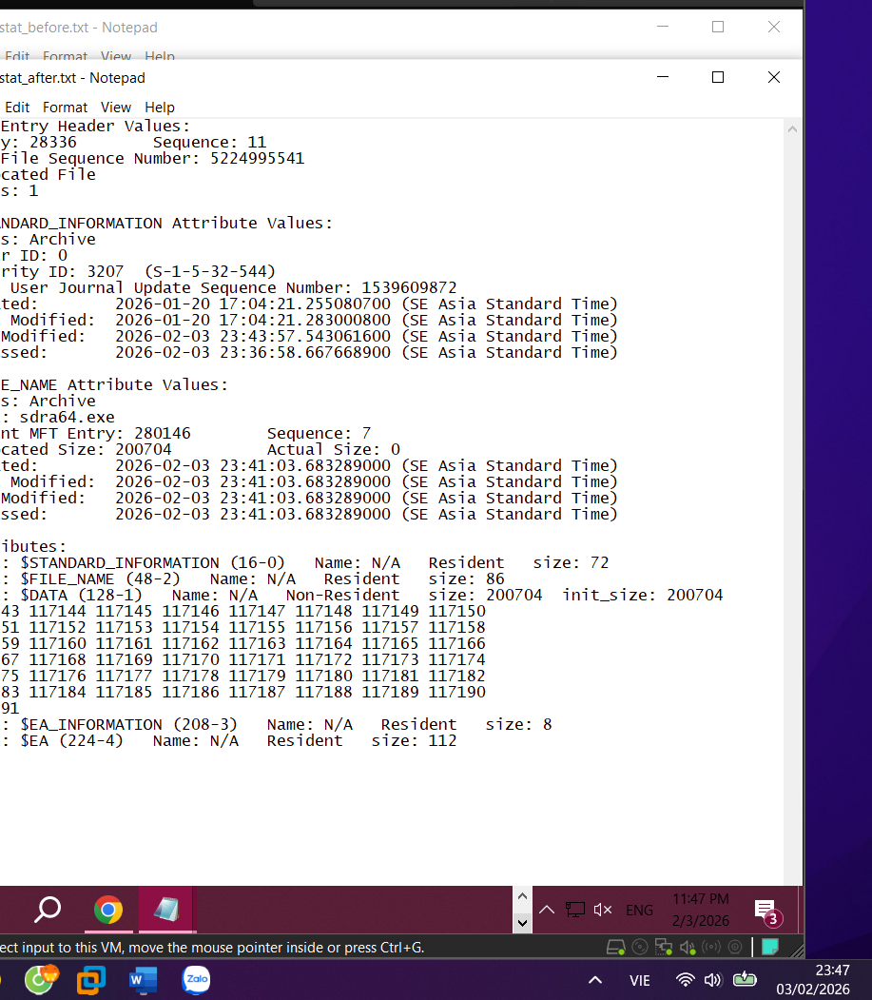

**Malware Forensics with TSK & Offline Registry**
# Learning Objectives
After completing this lab, students will be able to:
- Create and “expose” Alternate Data Streams (ADS) using TSK (fls/icat) instead of relying only on the Windows view.
- Perform cross-view detection: compare file listings from the MFT (TSK) and from Windows/WinAPI to identify suspicious discrepancies.
- Detect timestomping by checking SIA vs FNA timestamp discrepancies via istat.
- Extract a locked Registry hive using TSK and compare offline (RegistryExplorer/offreg) vs online (regedit/reg query) views to identify suspicious keys/values.
# 0) Environment Setup (Required)
## Requirements:
- 1 Windows VM (VirtualBox/VMware); take a clean snapshot before starting.
- Install The Sleuth Kit (TSK): mmls, fls, ifind, istat, icat.
- Install Sysinternals streams.exe to demonstrate ADS in the Windows view.
- Install Registry Explorer (or any tool that can open offline hives).
- Run CMD/PowerShell as Administrator (Run as administrator).
- Create a working folder: C:\temp (if it doesn't exist).
## Suggested tool locations (adjust as needed):
| C:\Tools\sleuthkit\bin
C:\Tools\Sysinternals\streams.exe
C:\temp |
| --- |

## Safety note:
Work only inside a VM or on disk images. Do not use real malware on a physical machine. This lab trains forensic and cross-view skills; no real rootkit is required.
## How to obtain the NTFS partition OFFSET (required for all TSK commands):
- Run mmls to view the partition table and record the Start sector (often 2048 on common setups).
- In this lab, OFFSET = the Start sector of the NTFS partition that contains drive C:.
| mmls \\.\PhysicalDrive0 |
| --- |

Example: if mmls shows the NTFS partition starts at 2048, use -o2048 in fls/ifind/istat/icat.

- NTFS partition OFFSET: 239616
### If you cannot access \\.\PhysicalDrive0:
- Ensure CMD/PowerShell is running as Administrator.
- If it still fails due to policy/EDR, switch to a disk image (raw/E01) provided by the instructor and run TSK against the image (class-dependent).
# 1) Part A — ADS: Create, Verify, and Extract with TSK
## A1. Create ADS (Windows view)
In C:\ (CMD as Administrator):
| cd /d C:\ 
echo "This is a normal file." > host.txt
echo "This is a hidden message!" > host.txt:hidden_stream.txt
type C:\Windows\System32\notepad.exe > host.txt:hidden_notepad.exe |
| --- |
|  |

## A2. Verify using Windows / Sysinternals
| dir host.txt
C:\Tools\Sysinternals\streams.exe C:\host.txt |
| --- |

Expected: dir does not reveal ADS; streams.exe lists the streams associated with host.txt.
## A3. Investigate the low-level view using TSK (MFT view)
1) (Recommended) Add TSK to PATH:
| set PATH=%PATH%;C:\Tools\sleuthkit\bin |
| --- |

2) Determine the NTFS OFFSET (Start sector):
| mmls \\.\PhysicalDrive0 |
| --- |
| OFFSET = 239616 |

3) Use fls to locate ADS entries related to host.txt:
| fls -o<OFFSET> -r -p \\.\PhysicalDrive0 \| findstr "host.txt" 239616 |
| --- |

Tip for reading fls output: the number at the beginning of each line (before ':') is often the inode. Lines like host.txt:hidden_*:*:$DATA indicate ADS streams.
4) Extract ADS content with icat:
| icat -o<OFFSET> \\.\PhysicalDrive0 <INODE-HIDDEN-STREAM> > C:\temp\extracted_message.txt =>  icat -o239616 \\.\PhysicalDrive0 923-128-3 > C:\temp\extracted_message.txt
icat -o<OFFSET> \\.\PhysicalDrive0 <INODE-HIDDEN-NOTE>   > C:\temp\extracted_notepad.exe => icat -o239616 \\.\PhysicalDrive0 923-128-5 > C:\temp\extracted_notepad.exe |
| --- |

Deliverable A: C:\temp\extracted_message.txt, C:\temp\extracted_notepad.exe, and a screenshot or log of the fls output showing ADS.
### Quick check of extracted files:
| type C:\temp\extracted_message.txt
dir C:\temp\extracted_notepad.exe |
| --- |

# 2) Part B — File/Dir Cross-view: MFT (TSK) vs Windows View
## B1. Create a payload for comparison (simulate hidden/suspicious data)
| mkdir C:\Windows\very_secret_malware
echo "I am a malicious payload" > C:\Windows\very_secret_malware\payload.dll |
| --- |

## B2. Collect both views
Windows view (high-level):
| dir /a /s /b C:\Windows > C:\temp\windows_view.txt |
| --- |

MFT view (low-level) — dump using fls:
| fls -o<OFFSET> -r -p \\.\PhysicalDrive0 > C:\temp\mft_view.txt => fls -o239616 -r -p \\.\PhysicalDrive0 > C:\temp\mft_view.txt |
| --- |

## B3. Compare (diff) to find anomalies
PowerShell:
| $w = Get-Content C:\temp\windows_view.txt
$m = Get-Content C:\temp\mft_view.txt
Compare-Object -ReferenceObject $w -DifferenceObject $m \| Out-File C:\temp\diff.txt |
| --- |
|  |

Detection criterion: “present in mft_view but missing from windows_view” is highly suspicious (cross-view concept).
Teaching hint (safe, no real rootkit): create online_view_filtered.txt by removing lines containing very_secret_malware from windows_view.txt, then ask students to run diff and explain the discrepancy using cross-view logic.
Deliverable B: windows_view.txt, mft_view.txt, diff.txt + a 5–10 line conclusion.
### Optional to reduce dataset size:
If C:\Windows is too large, the instructor can switch to a smaller folder (e.g., C:\LabTest), as long as both Windows view and MFT view cover the same scope.
# 3) Part C — Timestomping: Detect SIA vs FNA Discrepancies with istat
## C1. Create a target file and capture baseline
| copy C:\Windows\System32\notepad.exe C:\temp\sdra64.exe |
| --- |

Find the inode for sdra64.exe on the NTFS partition:
| ifind -o<OFFSET> -n /temp/sdra64.exe \\.\PhysicalDrive0 |
| --- |

Then run istat and save baseline output:

| istat -o<OFFSET> \\.\PhysicalDrive0 <INODE-of-sdra64.exe> > C:\temp\istat_before.txt |
| --- |

## C2. Timestomp (simulation)
PowerShell: copy timestamps from kernel32.dll to sdra64.exe
| $src = Get-Item C:\Windows\System32\kernel32.dll
$dst = Get-Item C:\temp\sdra64.exe
$dst.CreationTime  = $src.CreationTime
$dst.LastWriteTime = $src.LastWriteTime
$dst.LastAccessTime= $src.LastAccessTime |
| --- |

## C3. Re-check with istat
| istat -o<OFFSET> \\.\PhysicalDrive0 <INODE-of-sdra64.exe> > C:\temp\istat_after.txt |
| --- |

Conclusion to draw: timestomping typically changes timestamps in Standard Information (SIA) as shown by Windows, while File Name (FNA) timestamps may still reflect different times. If SIA looks “old” but FNA is “newer/mismatched”, that is a strong red flag.
Deliverable C: istat_before.txt, istat_after.txt + a 3–5 sentence explanation.

# 4) Part D — Registry Cross-view: Offline Hive vs regedit/reg query
## D1. Extract the SOFTWARE hive using TSK (bypass file lock)
1) Find the inode for the SOFTWARE hive:
| ifind -o<OFFSET> -n /Windows/System32/config/SOFTWARE \\.\PhysicalDrive0 = > ifind -o239616 -n /Windows/System32/config/SOFTWARE \\.\PhysicalDrive0 |
| --- |

2) Dump the hive to a file for offline analysis:
| icat -o<OFFSET> \\.\PhysicalDrive0 <INODE> > C:\temp\SOFTWARE.hive = > icat -o239616 \\.\PhysicalDrive0 58480 > C:\temp\SOFTWARE.hive |
| --- |

## D2. Compare Offline vs Online
- Offline view: open C:\temp\SOFTWARE.hive in RegistryExplorer (File → Load Hive…).
- Online view: open regedit.exe and browse HKLM\SOFTWARE (or use reg query).
If you can see a key/value offline but not online, propose a hypothesis: the system may be hooking/filtering Registry enumeration APIs. In this lab, you can simulate a mismatch without a real rootkit (see below).
### Safe simulation (no real rootkit):
- Create a key: HKLM\SOFTWARE\SecretMalwareKey (add 1–2 values).
- Power off the VM and extract the SOFTWARE hive offline as in D1 (SOFTWARE.hive).
- Power on the VM again and delete SecretMalwareKey.
- Compare: the previously dumped offline hive still contains the artifact; the online view no longer does.
## Advanced option: dump offline using offreg.dll
Assign an extra task: write a small tool using offreg.dll to export offline_view.txt, then compare it to online_view.txt (from reg query). Keys/values present offline but missing online are suspicious.
Deliverable D: SOFTWARE.hive + screenshots/logs showing the key/value location offline and online + conclusion.
# Questions
- Why can dir fail to show ADS while TSK can see and extract ADS?
- Lệnh dir thất bại vì nó dựa vào giao diện Windows vốn mặc định ẩn các luồng dữ liệu phụ, trong khi TSK đọc trực tiếp từ bảng tập tin gốc MFT nên nhìn thấy tất cả. Do đó, TSK có thể truy xuất các dữ liệu ẩn này dưới dạng các thuộc tính dữ liệu riêng biệt mà hệ điều hành không hiển thị

- In the cross-view diff, which line(s) are the most suspicious and why? (relate to “present in MFT but missing in WinAPI”).
- Những dòng đáng ngờ nhất là các tập tin có mặt trong dữ liệu MFT nhưng lại biến mất khi xem bằng giao diện Windows. Sự chênh lệch này là bằng chứng cho thấy mã độc đang can thiệp vào hệ thống để che giấu sự tồn tại của tập tin đó

- How do you identify timestomping in istat output? (SIA vs FNA).
- Nhận diện kỹ thuật này khi thấy thời gian trong thuộc tính thông tin chuẩn hiển thị giá trị cũ giả mạo, trong khi thời gian của thuộc tính tên tập tin vẫn giữ nguyên mốc thời gian thực mới hơn. Sự sai lệch không đồng nhất giữa hai mốc thời gian này trên cùng một tập tin chính là dấu hiệu tố cáo hành vi giả mạo

- What technique can Registry cross-view help detect? (hint: hook/filter enumeration of keys/values).
- Kỹ thuật này giúp phát hiện các khóa dữ liệu đang bị ẩn đi do mã độc can thiệp vào quá trình liệt kê của hệ điều hành. Bằng cách so sánh dữ liệu trích xuất ngoại tuyến với giao diện trực tuyến, ta sẽ tìm ra những thành phần thực sự tồn tại trên đĩa cứng nhưng lại không hiển thị trên màn hình
# Lab Notes Template
- NTFS partition OFFSET: __________ 239616
- Path & inode for host.txt ADS: __________ 923-128-3
- Path & inode for sdra64.exe: __________ 923-128-5
- Path & inode for SOFTWARE hive: __________ 28336
- Record all commands and key outputs to preserve a solid chain of evidence. /Windows/System32/config/SOFTWARE  - 58480
**Tìm**** Offset:**
mmls \\.\PhysicalDrive0
**Tìm**** ****Inode**** ****cho**** ADS ****của**** host.txt:**
fls -o239616 -r -p \\.\PhysicalDrive0 \| findstr "host.txt"
**Tìm Inode cho sdra64.exe:**
ifind -o239616 -n /temp/sdra64.exe \\.\PhysicalDrive0
**Tìm**** ****Inode**** ****cho**** SOFTWARE hive:**
ifind -o239616 -n /Windows/System32/config/SOFTWARE \\.\PhysicalDrive0
